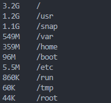

# Day 6: Advanced Linux Administration & Automation

## What You'll Learn Today
- Advanced file system management and permissions
- User and group administration
- System resource management and optimization
- Advanced shell scripting and automation
- Package management and software deployment
- System backup and recovery procedures
- Performance tuning and optimization
- Cron jobs and task scheduling mastery

---

## TASK 1: Advanced File System Management
**What you'll learn**: Master Linux file systems, permissions, and disk management

**Steps**:
1. Analyze disk usage and file systems:
   ```bash
   df -hT
   lsblk
   findmnt
   ```
   df -ht 
   
   lsblk
   
    findmnt
    

2. Find large files and directories:
   ```bash
   find / -type f -size +100M 2>/dev/null | head -10
   du -sh /var/* 2>/dev/null | sort -hr | head -10
   ```
   
3. Advanced file permissions and ACLs:
   ```bash
   # Create test directory structure
   mkdir -p ~/devops-learning/day6/{projects,shared,secure}
   
   # Set advanced permissions
   chmod 755 ~/devops-learning/day6/projects
   chmod 775 ~/devops-learning/day6/shared  
   chmod 700 ~/devops-learning/day6/secure
   
   # Check permissions
   ls -la ~/devops-learning/day6/
   ```
   
4. File ownership and group management:
   ```bash
   # Check current user and groups
   whoami
   groups
   id
   

   # Create test files with different ownership
   touch ~/devops-learning/day6/projects/project1.txt
   touch ~/devops-learning/day6/shared/team-file.txt
   ```
5. Find files by various criteria:
   ```bash
   # Files modified in last 24 hours
   find ~/devops-learning -type f -mtime -1
   
   
   # Files larger than 1KB
   find ~/devops-learning -type f -size +1k
   
   # Executable files
   find ~/devops-learning -type f -executable
   ```

**Tell me**: 
- What file systems are mounted on your system?

- Which directories consume the most disk space?


- What are the permission differences between the directories you created?
projects → 755 → Owner full access, group + others read/execute only.
shared → 775 → Owner + group full access, others read/execute.
secure → 700 → Owner full access only, no group/other access.
---

## TASK 2: User and Group Administration
**What you'll learn**: Manage users, groups, and access control

**Steps**:
1. Analyze current user environment:
   ```bash
   # Current user information
   echo "Current user: $(whoami)"
   echo "User ID: $(id -u)"
   echo "Primary group: $(id -gn)"
   echo "All groups: $(groups)"
   ```
   
2. Check user account details:
   ```bash
   # User account information
   getent passwd $USER
   finger $USER 2>/dev/null || echo "finger command not available"
   ```
3. Examine system users and groups:
   ```bash
   # System users (UID < 1000)
   awk -F: '$3 < 1000 {print $1 ":" $3}' /etc/passwd | head -10
   
   # Regular users (UID >= 1000)
   awk -F: '$3 >= 1000 {print $1 ":" $3}' /etc/passwd
   
   # System groups
   cat /etc/group | head -10
   ```
  awk -F:
  

  cat-
  

4. Check sudo privileges:
   ```bash
   # Check sudo access
   sudo -l 2>/dev/null || echo "Checking sudo privileges..."
   
   # Check if user is in sudo group
   groups | grep -q sudo && echo "User has sudo access" || echo "No sudo access detected"
   ```
5. Create a user management script:
   ```bash
   nano ~/devops-learning/day6/user_audit.sh
   ```
   Add this content:
   ```bash
   #!/bin/bash
   # User Account Audit Script
   
   echo "=== USER ACCOUNT AUDIT ==="
   echo "Generated: $(date)"
   echo "System: $(hostname)"
   echo ""
   
   echo "=== CURRENT USER INFO ==="
   echo "Username: $(whoami)"
   echo "User ID: $(id -u)"
   echo "Primary Group: $(id -gn) ($(id -g))"
   echo "All Groups: $(groups)"
   echo "Home Directory: $HOME"
   echo "Shell: $SHELL"
   echo ""
   
   echo "=== SYSTEM USERS SUMMARY ==="
   echo "Total users in /etc/passwd: $(wc -l < /etc/passwd)"
   echo "System users (UID < 1000): $(awk -F: '$3 < 1000' /etc/passwd | wc -l)"
   echo "Regular users (UID >= 1000): $(awk -F: '$3 >= 1000' /etc/passwd | wc -l)"
   echo ""
   
   echo "=== RECENT LOGIN ACTIVITY ==="
   echo "Current sessions:"
   who | wc -l
   echo "Last 5 logins:"
   last -n 5 2>/dev/null || echo "Login history not available"
   echo ""
   
   echo "=== SUDO PRIVILEGES ==="
   if sudo -l >/dev/null 2>&1; then
       echo "✅ User has sudo privileges"
   else
       echo "❌ User does not have sudo privileges"
   fi
   
   echo ""
   echo "=== AUDIT COMPLETE ==="
   ```
6. Make executable and run:
   ```bash
   chmod +x ~/devops-learning/day6/user_audit.sh
   ~/devops-learning/day6/user_audit.sh
   ```
   

**Tell me**: 
- How many total users are on your system?

- What groups is your user account a member of?

- Do you have sudo privileges?
sudo -Yes Full Privileges.
---

## TASK 3: System Resource Management
**What you'll learn**: Monitor and manage system resources effectively

**Steps**:
1. Advanced memory analysis:
   ```bash
   # Detailed memory information
   free -h
   cat /proc/meminfo | head -10
   
   # Memory usage by process
   ps aux --sort=-%mem | head -10
   ```

   

   
2. CPU information and monitoring:
   ```bash
   # CPU information
   lscpu
   cat /proc/cpuinfo | grep -E "model name|cpu cores" | head -5
   
   # CPU usage patterns
   top -b -n1 | head -15
   ```
   
   
3. Advanced process management:
   ```bash
   # Process tree
   pstree -p | head -20
   
   # Processes by CPU usage
   ps aux --sort=-%cpu | head -10
   
   # Process count by user
   ps aux | awk '{print $1}' | sort | uniq -c | sort -nr
   ```


4. System load analysis:
   ```bash
   # Load average explanation
   uptime
   cat /proc/loadavg
   
   # Number of CPU cores (for load comparison)
   nproc
   ```
5. Create a comprehensive system monitor:
   ```bash
   nano ~/devops-learning/day6/system_health.sh
   ```
   Add this content:
   ```bash
   #!/bin/bash
   # Comprehensive System Health Monitor
   
   echo "=== COMPREHENSIVE SYSTEM HEALTH CHECK ==="
   echo "Timestamp: $(date)"
   echo "Hostname: $(hostname)"
   echo "Uptime: $(uptime -p 2>/dev/null || uptime)"
   echo ""
   
   echo "=== CPU INFORMATION ==="
   echo "CPU Model: $(lscpu | grep "Model name" | cut -d: -f2 | xargs)"
   echo "CPU Cores: $(nproc)"
   echo "Current Load: $(cat /proc/loadavg | cut -d' ' -f1-3)"
   echo "Load per Core: $(echo "scale=2; $(cat /proc/loadavg | cut -d' ' -f1) / $(nproc)" | bc -l 2>/dev/null || echo "N/A")"
   echo ""
   
   echo "=== MEMORY ANALYSIS ==="
   TOTAL_MEM=$(free -m | awk 'NR==2{print $2}')
   USED_MEM=$(free -m | awk 'NR==2{print $3}')
   FREE_MEM=$(free -m | awk 'NR==2{print $4}')
   USAGE_PERCENT=$(echo "scale=1; $USED_MEM * 100 / $TOTAL_MEM" | bc -l 2>/dev/null || echo "N/A")
   
   echo "Total Memory: ${TOTAL_MEM}MB"
   echo "Used Memory: ${USED_MEM}MB (${USAGE_PERCENT}%)"
   echo "Free Memory: ${FREE_MEM}MB"
   echo ""
   
   echo "=== DISK USAGE ==="
   df -h | grep -vE "^Filesystem|tmpfs|cdrom" | head -5
   echo ""
   
   echo "=== TOP 5 MEMORY CONSUMERS ==="
   ps aux --sort=-%mem | awk 'NR<=6{printf "%-20s %s%%\n", $11, $4}'
   echo ""
   
   echo "=== TOP 5 CPU CONSUMERS ==="
   ps aux --sort=-%cpu | awk 'NR<=6{printf "%-20s %s%%\n", $11, $3}'
   echo ""
   
   echo "=== NETWORK INTERFACE STATUS ==="
   ip link show | grep "state UP" | awk '{print $2}' | sed 's/:$//'
   echo ""
   
   echo "=== SYSTEM HEALTH SUMMARY ==="
   # Health scoring logic
   LOAD_SCORE=0
   MEM_SCORE=0
   
   # Load check (assuming 4 cores max for calculation)
   LOAD_1MIN=$(cat /proc/loadavg | cut -d' ' -f1 | cut -d. -f1)
   [ "$LOAD_1MIN" -lt 2 ] && LOAD_SCORE=1
   
   # Memory check (less than 80% usage is good)
   [ "${USAGE_PERCENT%.*}" -lt 80 ] 2>/dev/null && MEM_SCORE=1
   
   HEALTH_SCORE=$((LOAD_SCORE + MEM_SCORE))
   case $HEALTH_SCORE in
       2) echo "🟢 EXCELLENT - System running optimally" ;;
       1) echo "🟡 GOOD - System performing well with minor concerns" ;;
       0) echo "🔴 ATTENTION - System may need optimization" ;;
   esac
   
   echo ""
   echo "=== HEALTH CHECK COMPLETE ==="
   ```
6. Make executable and run:
   ```bash
   chmod +x ~/devops-learning/day6/system_health.sh
   ~/devops-learning/day6/system_health.sh
   ```

**Tell me**: 
- What's your system's health score?

- Which process is consuming the most memory?

- What's your CPU load per core?

---

## TASK 4: Advanced Shell Scripting
**What you'll learn**: Write sophisticated automation scripts

**Steps**:
1. Create a multi-function utility script:
   ```bash
   nano ~/devops-learning/day6/devops_toolkit.sh
   ```
   Add this content:
   ```bash
   #!/bin/bash
   # DevOps Toolkit - Multi-purpose Administration Script
   
   # Color codes for output
   RED='\033[0;31m'
   GREEN='\033[0;32m'
   YELLOW='\033[1;33m'
   BLUE='\033[0;34m'
   NC='\033[0m' # No Color
   
   # Function to display menu
   show_menu() {
       clear
       echo -e "${BLUE}=== DevOps Toolkit ===${NC}"
       echo -e "${GREEN}1.${NC} System Information"
       echo -e "${GREEN}2.${NC} Disk Usage Analysis"
       echo -e "${GREEN}3.${NC} Process Monitor"
       echo -e "${GREEN}4.${NC} Network Status"
       echo -e "${GREEN}5.${NC} Service Status Check"
       echo -e "${GREEN}6.${NC} Log Analysis"
       echo -e "${GREEN}7.${NC} Security Scan"
       echo -e "${GREEN}8.${NC} Performance Report"
       echo -e "${GREEN}9.${NC} Exit"
       echo ""
       echo -n "Select option (1-9): "
   }
   
   # Function 1: System Information
   system_info() {
       echo -e "${YELLOW}=== SYSTEM INFORMATION ===${NC}"
       echo "Hostname: $(hostname)"
       echo "OS: $(cat /etc/os-release | grep PRETTY_NAME | cut -d'"' -f2 2>/dev/null || uname -s)"
       echo "Kernel: $(uname -r)"
       echo "Architecture: $(uname -m)"
       echo "Uptime: $(uptime -p 2>/dev/null || uptime | cut -d',' -f1)"
       echo "Users logged in: $(who | wc -l)"
       echo ""
   }
   
   # Function 2: Disk Usage Analysis
   disk_analysis() {
       echo -e "${YELLOW}=== DISK USAGE ANALYSIS ===${NC}"
       echo "Filesystem usage:"
       df -h | head -10
       echo ""
       echo "Largest directories in /var:"
       sudo du -sh /var/* 2>/dev/null | sort -hr | head -5
       echo ""
   }
   
   # Function 3: Process Monitor
   process_monitor() {
       echo -e "${YELLOW}=== PROCESS MONITOR ===${NC}"
       echo "Top 5 CPU consumers:"
       ps aux --sort=-%cpu | head -6
       echo ""
       echo "Top 5 Memory consumers:"
       ps aux --sort=-%mem | head -6
       echo ""
   }
   
   # Function 4: Network Status
   network_status() {
       echo -e "${YELLOW}=== NETWORK STATUS ===${NC}"
       echo "Active network interfaces:"
       ip link show | grep "state UP"
       echo ""
       echo "Listening ports:"
       ss -tln | head -10
       echo ""
       echo "Network connections:"
       ss -t | grep ESTAB | wc -l
       echo " established connections"
       echo ""
   }
   
   # Function 5: Service Status Check
   service_check() {
       echo -e "${YELLOW}=== SERVICE STATUS CHECK ===${NC}"
       services=("ssh" "nginx" "apache2" "mysql" "postgresql")
       for service in "${services[@]}"; do
           if systemctl is-active --quiet $service 2>/dev/null; then
               echo -e "✅ $service: ${GREEN}Running${NC}"
           elif service $service status >/dev/null 2>&1; then
               echo -e "✅ $service: ${GREEN}Running${NC}"
           else
               echo -e "❌ $service: ${RED}Not running${NC}"
           fi
       done
       echo ""
   }
   
   # Function 6: Log Analysis
   log_analysis() {
       echo -e "${YELLOW}=== LOG ANALYSIS ===${NC}"
       echo "Recent system messages:"
       sudo journalctl --since "1 hour ago" --no-pager | tail -5 2>/dev/null || echo "System logs not accessible"
       echo ""
       echo "Auth log summary:"
       sudo grep "$(date +%b\ %d)" /var/log/auth.log 2>/dev/null | tail -3 || echo "Auth logs not accessible"
       echo ""
   }
   
   # Function 7: Security Scan
   security_scan() {
       echo -e "${YELLOW}=== SECURITY SCAN ===${NC}"
       echo "Checking for failed login attempts:"
       sudo grep "Failed password" /var/log/auth.log 2>/dev/null | tail -3 || echo "No recent failed attempts found"
       echo ""
       echo "Open ports scan:"
       ss -tln | grep LISTEN | wc -l
       echo " ports are listening"
       echo ""
       echo "Checking for security updates:"
       apt list --upgradable 2>/dev/null | grep -i security | wc -l
       echo " security updates available"
       echo ""
   }
   
   # Function 8: Performance Report
   performance_report() {
       echo -e "${YELLOW}=== PERFORMANCE REPORT ===${NC}"
       echo "Load Average: $(uptime | awk -F'load average:' '{print $2}')"
       echo "Memory Usage: $(free | grep Mem | awk '{printf "%.1f%%", $3/$2 * 100.0}')"
       echo "Disk Usage: $(df / | tail -1 | awk '{print $5}')"
       echo ""
       echo "System responsiveness test:"
       time ls / > /dev/null
       echo ""
   }
   
   # Main script loop
   main() {
       while true; do
           show_menu
           read -r choice
           case $choice in
               1) system_info; read -p "Press Enter to continue..." ;;
               2) disk_analysis; read -p "Press Enter to continue..." ;;
               3) process_monitor; read -p "Press Enter to continue..." ;;
               4) network_status; read -p "Press Enter to continue..." ;;
               5) service_check; read -p "Press Enter to continue..." ;;
               6) log_analysis; read -p "Press Enter to continue..." ;;
               7) security_scan; read -p "Press Enter to continue..." ;;
               8) performance_report; read -p "Press Enter to continue..." ;;
               9) echo -e "${GREEN}Goodbye!${NC}"; exit 0 ;;
               *) echo -e "${RED}Invalid option. Please try again.${NC}"; sleep 2 ;;
           esac
       done
   }
   
   # Run the main function
   main
   ```
2. Make executable:
   ```bash
   chmod +x ~/devops-learning/day6/devops_toolkit.sh
   ```
3. Test the script (try option 1):
   ```bash
   ~/devops-learning/day6/devops_toolkit.sh
   ```

**Tell me**: 
- Did the interactive menu work properly?

- Which system information was most interesting?
Its OS-kernal for me looks Intressting.
- How many services are running on your system?


---

## TASK 5: Package Management Mastery
**What you'll learn**: Advanced package management and software deployment

**Steps**:
1. Package management analysis:
   ```bash
   # Check package manager
   which apt && echo "Using APT" || echo "APT not available"
   which yum && echo "Using YUM" || echo "YUM not available"
   
   # List installed packages
   dpkg -l | wc -l 2>/dev/null || rpm -qa | wc -l 2>/dev/null || echo "Package count unavailable"
   ```
   
2. Search and analyze packages:
   ```bash
   # Search for development tools
   apt search "build-essential" 2>/dev/null | head -5 || echo "Package search not available"
   
   # Show package information
   apt show curl 2>/dev/null | head -10 || echo "Package info not available"
   ```
   
3. Check for updates:
   ```bash
   # Update package lists
   sudo apt update 2>/dev/null || echo "Package update not available"
   
   # List upgradable packages
   apt list --upgradable 2>/dev/null | head -10 || echo "Upgradable list not available"
   ```
   
4. Create package management script:
   ```bash
   nano ~/devops-learning/day6/package_manager.sh
   ```
   Add this content:
   ```bash
   #!/bin/bash
   # Package Management Helper Script
   
   echo "=== PACKAGE MANAGEMENT REPORT ==="
   echo "Generated: $(date)"
   echo ""
   
   # Detect package manager
   if command -v apt >/dev/null; then
       PKG_MGR="apt"
       echo "Package Manager: APT (Debian/Ubuntu)"
   elif command -v yum >/dev/null; then
       PKG_MGR="yum"
       echo "Package Manager: YUM (Red Hat/CentOS)"
   else
       PKG_MGR="unknown"
       echo "Package Manager: Unknown/Custom"
   fi
   echo ""
   
   if [ "$PKG_MGR" = "apt" ]; then
       echo "=== PACKAGE STATISTICS ==="
       echo "Total packages installed: $(dpkg -l | grep ^ii | wc -l)"
       echo "Upgradable packages: $(apt list --upgradable 2>/dev/null | grep -c upgradable)"
       echo ""
       
       echo "=== RECENTLY INSTALLED ==="
       echo "Last 5 installed packages:"
       grep "install " /var/log/dpkg.log 2>/dev/null | tail -5 | awk '{print $4}' || echo "Installation log not available"
       echo ""
       
       echo "=== SECURITY UPDATES ==="
       echo "Available security updates:"
       apt list --upgradable 2>/dev/null | grep -i security | wc -l
       echo ""
       
       echo "=== LARGE PACKAGES ==="
       echo "Largest installed packages:"
       dpkg-query -Wf '${Installed-Size}\t${Package}\n' 2>/dev/null | sort -n | tail -5 | while read size pkg; do
           echo "$pkg: $((size/1024))MB"
       done || echo "Package size info not available"
   fi
   
   echo ""
   echo "=== DEVELOPMENT TOOLS CHECK ==="
   tools=("git" "curl" "wget" "vim" "nano" "python3" "nodejs" "docker")
   for tool in "${tools[@]}"; do
       if command -v $tool >/dev/null; then
           echo "✅ $tool: installed"
       else
           echo "❌ $tool: not installed"
       fi
   done
   
   echo ""
   echo "=== PACKAGE MANAGEMENT COMPLETE ==="
   ```
5. Make executable and run:
   ```bash
   chmod +x ~/devops-learning/day6/package_manager.sh
   ~/devops-learning/day6/package_manager.sh
   ```

**Tell me**: 
- How many packages are installed on your system?
-607
- Which development tools are already installed?

- Are there any security updates available?
yes -9

---

## TASK 6: Backup and Recovery System
**What you'll learn**: Implement comprehensive backup strategies

**Steps**:
1. Create backup system structure:
   ```bash
   mkdir -p ~/devops-learning/day6/backups/{daily,weekly,system}
   ```
2. Create a comprehensive backup script:
   ```bash
   nano ~/devops-learning/day6/backup_system.sh
   ```
   Add this content:
   ```bash
   #!/bin/bash
   # Comprehensive Backup System
   
   # Configuration
   BACKUP_BASE="$HOME/devops-learning/day6/backups"
   DATE=$(date +%Y%m%d_%H%M%S)
   LOGFILE="$BACKUP_BASE/backup_$DATE.log"
   
   # Color codes
   GREEN='\033[0;32m'
   RED='\033[0;31m'
   YELLOW='\033[1;33m'
   NC='\033[0m'
   
   # Logging function
   log() {
       echo "$(date '+%Y-%m-%d %H:%M:%S') - $1" | tee -a "$LOGFILE"
   }
   
   # Create backup directories
   create_backup_structure() {
       log "Creating backup directory structure..."
       mkdir -p "$BACKUP_BASE"/{daily,weekly,system}
       echo -e "${GREEN}✅ Backup directories created${NC}"
   }
   
   # Backup user data
   backup_user_data() {
       log "Starting user data backup..."
       
       # Backup DevOps learning directory
       BACKUP_FILE="$BACKUP_BASE/daily/devops_learning_$DATE.tar.gz"
       tar -czf "$BACKUP_FILE" -C "$HOME" devops-learning 2>/dev/null
       
       if [ -f "$BACKUP_FILE" ]; then
           SIZE=$(du -sh "$BACKUP_FILE" | cut -f1)
           log "✅ DevOps learning backup created: $SIZE"
           echo -e "${GREEN}✅ User data backup: $SIZE${NC}"
       else
           log "❌ User data backup failed"
           echo -e "${RED}❌ User data backup failed${NC}"
       fi
   }
   
   # Backup system configuration
   backup_system_config() {
       log "Starting system configuration backup..."
       
       CONFIG_BACKUP="$BACKUP_BASE/system/system_config_$DATE.tar.gz"
       
       # List of important system directories to backup
       SYSTEM_DIRS=(
           "/etc/nginx"
           "/etc/ssh"
           "/etc/hosts"
           "/etc/hostname"
           "/etc/resolv.conf"
       )
       
       # Create temp directory for system files
       TEMP_DIR="/tmp/system_backup_$$"
       mkdir -p "$TEMP_DIR/system_config"
       
       for dir in "${SYSTEM_DIRS[@]}"; do
           if [ -e "$dir" ]; then
               sudo cp -r "$dir" "$TEMP_DIR/system_config/" 2>/dev/null
               log "✅ Backed up: $dir"
           fi
       done
       
       # Create archive
       tar -czf "$CONFIG_BACKUP" -C "$TEMP_DIR" system_config 2>/dev/null
       rm -rf "$TEMP_DIR"
       
       if [ -f "$CONFIG_BACKUP" ]; then
           SIZE=$(du -sh "$CONFIG_BACKUP" | cut -f1)
           log "✅ System config backup created: $SIZE"
           echo -e "${GREEN}✅ System config backup: $SIZE${NC}"
       else
           log "❌ System config backup failed"
           echo -e "${RED}❌ System config backup failed${NC}"
       fi
   }
   
   # Create system information snapshot
   backup_system_info() {
       log "Creating system information snapshot..."
       
       INFO_FILE="$BACKUP_BASE/system/system_info_$DATE.txt"
       
       {
           echo "=== SYSTEM INFORMATION SNAPSHOT ==="
           echo "Generated: $(date)"
           echo "Hostname: $(hostname)"
           echo "OS: $(cat /etc/os-release 2>/dev/null | grep PRETTY_NAME || uname -s)"
           echo "Kernel: $(uname -r)"
           echo "Uptime: $(uptime)"
           echo ""
           echo "=== INSTALLED PACKAGES ==="
           dpkg -l 2>/dev/null | grep ^ii | wc -l && echo " packages installed" || echo "Package count unavailable"
           echo ""
           echo "=== DISK USAGE ==="
           df -h
           echo ""
           echo "=== MEMORY INFO ==="
           free -h
           echo ""
           echo "=== NETWORK INTERFACES ==="
           ip addr show 2>/dev/null || ifconfig 2>/dev/null || echo "Network info unavailable"
           echo ""
           echo "=== RUNNING SERVICES ==="
           systemctl list-units --type=service --state=running 2>/dev/null | head -20 || echo "Service list unavailable"
       } > "$INFO_FILE"
       
       log "✅ System information snapshot created"
       echo -e "${GREEN}✅ System info snapshot created${NC}"
   }
   
   # Cleanup old backups
   cleanup_old_backups() {
       log "Cleaning up old backups..."
       
       # Keep only last 7 daily backups
       find "$BACKUP_BASE/daily" -name "*.tar.gz" -mtime +7 -delete 2>/dev/null
       
       # Keep only last 4 weekly backups  
       find "$BACKUP_BASE/weekly" -name "*.tar.gz" -mtime +28 -delete 2>/dev/null
       
       log "✅ Old backup cleanup completed"
       echo -e "${GREEN}✅ Old backups cleaned up${NC}"
   }
   
   # Generate backup report
   generate_report() {
       log "Generating backup report..."
       
       REPORT_FILE="$BACKUP_BASE/backup_report_$DATE.txt"
       
       {
           echo "=== BACKUP REPORT ==="
           echo "Date: $(date)"
           echo "Backup Session ID: $DATE"
           echo ""
           echo "=== BACKUP SUMMARY ==="
           echo "Daily backups:"
           ls -lh "$BACKUP_BASE/daily/" 2>/dev/null | tail -5 || echo "No daily backups"
           echo ""
           echo "System backups:"  
           ls -lh "$BACKUP_BASE/system/" 2>/dev/null | tail -5 || echo "No system backups"
           echo ""
           echo "=== STORAGE USAGE ==="
           du -sh "$BACKUP_BASE"/* 2>/dev/null || echo "Storage calculation unavailable"
           echo ""
           echo "=== BACKUP LOG ==="
           tail -20 "$LOGFILE"
       } > "$REPORT_FILE"
       
       echo -e "${YELLOW}📊 Backup report: $REPORT_FILE${NC}"
       log "✅ Backup report generated"
   }
   
   # Main backup function
   main() {
       echo -e "${YELLOW}=== COMPREHENSIVE BACKUP SYSTEM ===${NC}"
       echo "Starting backup process..."
       echo ""
       
       create_backup_structure
       backup_user_data
       backup_system_config
       backup_system_info
       cleanup_old_backups
       generate_report
       
       echo ""
       echo -e "${GREEN}🎉 BACKUP PROCESS COMPLETE!${NC}"
       echo -e "${YELLOW}📋 Check report: $BACKUP_BASE/backup_report_$DATE.txt${NC}"
       echo -e "${YELLOW}📝 Full log: $LOGFILE${NC}"
   }
   
   # Run main function
   main
   ```
3. Make executable and run:
   ```bash
   chmod +x ~/devops-learning/day6/backup_system.sh
   ~/devops-learning/day6/backup_system.sh
   ```
   
4. Verify backups were created:
   ```bash
   ls -la ~/devops-learning/day6/backups/
   ls -la ~/devops-learning/day6/backups/*/
   ```


**Tell me**: 
- Did all backup components complete successfully?
Yes everythingd id good.

- What's the total size of your backups?

- Which backup report information was most useful?
in this document-/home/ubuntu/devops-learning/day6/backups/backup_report_20250925_001610.txt

---


