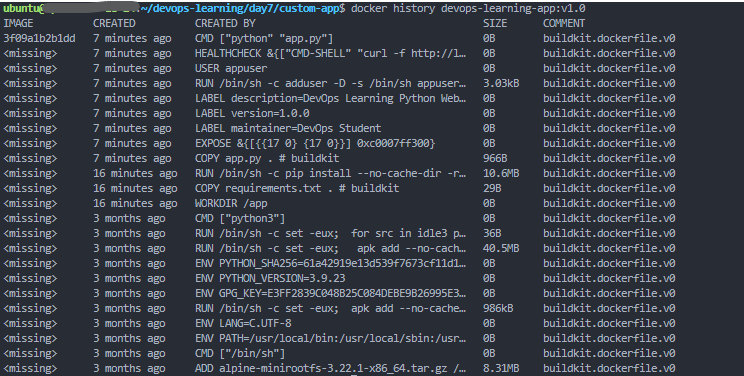
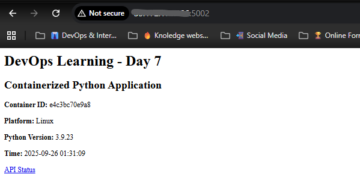
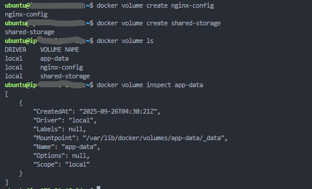
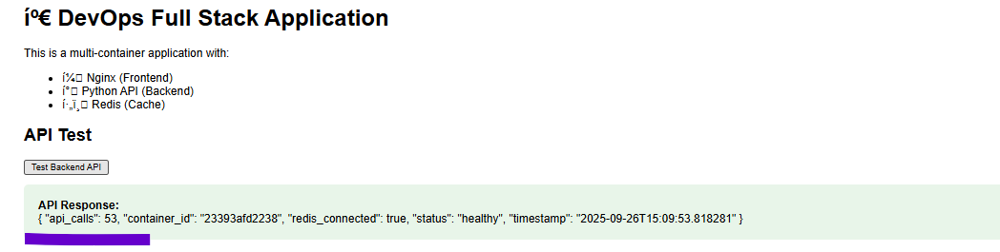

# Day 7: Container Technologies & Docker Fundamentals

## 🎯 Learning Objectives
By the end of Day 7, you will master:
- Docker installation and configuration
- Container lifecycle management
- Docker images and registries
- Container networking basics
- Volume management and data persistence
- Docker Compose for multi-container applications
- Container monitoring and troubleshooting
- Basic container security practices

## 📚 Prerequisites
- Completion of Days 1-6 (Linux fundamentals, process management, networking)
- Basic understanding of applications and services
- Familiarity with command-line operations
- Understanding of file systems and permissions

---

## 🐳 Why Containers Matter in DevOps

### **The Container Revolution**
Containers have transformed how we deploy and manage applications:
- **Consistency**: "It works on my machine" → "It works everywhere"
- **Efficiency**: Lightweight compared to virtual machines
- **Scalability**: Easy to scale applications up and down
- **Portability**: Run anywhere - laptop, server, cloud
- **Isolation**: Applications don't interfere with each other

### **Real-World Usage**
- **Netflix**: Runs thousands of microservices in containers
- **Google**: Everything runs in containers (2 billion per week!)
- **Uber**: Container-based microservices architecture
- **Banks**: Secure, isolated application deployment

---

## 🛠️ TASK 1: Docker Installation & Setup
**What you'll learn**: Install Docker and verify the installation

### **Steps**:
1. **Update system packages**:
   ```bash
   sudo apt update
   sudo apt upgrade -y
   ```

2. **Install Docker dependencies**:
   ```bash
   sudo apt install -y apt-transport-https ca-certificates curl software-properties-common
   ```

3. **Add Docker's official GPG key**:
   ```bash
   curl -fsSL https://download.docker.com/linux/ubuntu/gpg | sudo apt-key add -
   ```

4. **Add Docker repository**:
   ```bash
   sudo add-apt-repository "deb [arch=amd64] https://download.docker.com/linux/ubuntu $(lsb_release -cs) stable"
   ```

5. **Install Docker**:
   ```bash
   sudo apt update
   sudo apt install -y docker-ce docker-ce-cli containerd.io
   ```
   

6. **Add user to docker group** (to run without sudo):
   ```bash
   sudo usermod -aG docker $USER
   newgrp docker
   ```

7. **Verify Docker installation**:
   ```bash
   docker --version
   docker info
   sudo systemctl status docker
   ```

8. **Test with hello-world container**:
   ```bash
   docker run hello-world
   ```

### **Success Criteria**:
- ✅ Docker version displays correctly
- ✅ Docker service is running
- ✅ Hello-world container runs successfully
- ✅ No permission errors when running docker commands

---

## 📦 TASK 2: Container Basics & Image Management
**What you'll learn**: Work with Docker images and basic container operations

### **Steps**:
1. **Search for images on Docker Hub**:
   ```bash
   docker search nginx
   docker search python
   docker search alpine
   ```


2. **Pull images from Docker Hub**:
   ```bash
   docker pull nginx:latest
   docker pull python:3.9-alpine
   docker pull ubuntu:20.04
   ```

3. **List downloaded images**:
   ```bash
   docker images
   docker images --format "table {{.Repository}}\t{{.Tag}}\t{{.Size}}"
   ```

4. **Run containers from images**:
   ```bash
   # Run nginx in detached mode
   docker run -d --name my-nginx -p 8080:80 nginx:latest
   
   # Run interactive Ubuntu container
   docker run -it --name my-ubuntu ubuntu:20.04 /bin/bash
   ```

5. **Container management commands**:
   ```bash
   # List running containers
   docker ps
   
   # List all containers (including stopped)
   docker ps -a
   
   # Stop a container
   docker stop my-nginx
   
   # Start a stopped container
   docker start my-nginx
   
   # Remove a container
   docker rm my-ubuntu
   
   # Remove an image
   docker rmi python:3.9-alpine
   ```
   
   

6. **Test your nginx container**:
   ```bash
   curl http://localhost:8080
   ```
   

### **Challenge Exercise**:
Create a container management script:
```bash
nano ~/devops-learning/day7/container_manager.sh
```

Add this content:
```bash
#!/bin/bash
# Container Management Helper

echo "=== DOCKER CONTAINER MANAGER ==="
echo "1. List running containers"
echo "2. List all containers"  
echo "3. List images"
echo "4. Container resource usage"
echo "5. Start/Stop container"
echo "6. Clean up unused containers"
echo ""

read -p "Choose option (1-6): " choice

case $choice in
    1) docker ps --format "table {{.Names}}\t{{.Image}}\t{{.Status}}\t{{.Ports}}" ;;
    2) docker ps -a --format "table {{.Names}}\t{{.Image}}\t{{.Status}}" ;;
    3) docker images --format "table {{.Repository}}\t{{.Tag}}\t{{.Size}}" ;;
    4) docker stats --no-stream ;;
    5) read -p "Container name: " name
       read -p "Action (start/stop/restart): " action
       docker $action $name ;;
    6) docker container prune -f
       docker image prune -f
       echo "✅ Cleanup completed" ;;
    *) echo "Invalid option" ;;
esac
```

### **Assessment Questions**:
- How many images did you successfully pull?

- What's the size difference between ubuntu:20.04 and python:3.9-alpine?

- Did the nginx container respond on port 8080?

---

## 🏗️ TASK 3: Building Custom Docker Images
**What you'll learn**: Create Dockerfiles and build custom images

### **Steps**:
1. **Create a project directory**:
   ```bash
   mkdir -p ~/devops-learning/day7/custom-app
   cd ~/devops-learning/day7/custom-app
   ```

2. **Create a simple Python web application**:
   ```bash
   cat > app.py << 'EOF'
   from flask import Flask, jsonify
   import os
   import platform
   import datetime

   app = Flask(__name__)

   @app.route('/')
   def home():
       return """
       <h1>🐳 DevOps Learning - Day 7</h1>
       <h2>Containerized Python Application</h2>
       <p><strong>Container ID:</strong> {}</p>
       <p><strong>Platform:</strong> {}</p>
       <p><strong>Python Version:</strong> {}</p>
       <p><strong>Time:</strong> {}</p>
       <p><a href="/api/status">API Status</a></p>
       """.format(
           os.environ.get('HOSTNAME', 'Unknown'),
           platform.system(),
           platform.python_version(),
           datetime.datetime.now().strftime('%Y-%m-%d %H:%M:%S')
       )

   @app.route('/api/status')
   def api_status():
       return jsonify({
           'status': 'healthy',
           'container_id': os.environ.get('HOSTNAME', 'Unknown'),
           'timestamp': datetime.datetime.now().isoformat(),
           'version': '1.0.0'
       })

   if __name__ == '__main__':
       app.run(host='0.0.0.0', port=5000, debug=True)
   EOF
   ```

3. **Create requirements.txt**:
   ```bash
   cat > requirements.txt << 'EOF'
   Flask==2.3.3
   Werkzeug==2.3.7
   EOF
   ```

4. **Create a Dockerfile**:
   ```bash
   cat > Dockerfile << 'EOF'
   # Use Python alpine image for smaller size
   FROM python:3.9-alpine

   # Set working directory
   WORKDIR /app

   # Copy requirements first (for better caching)
   COPY requirements.txt .

   # Install Python dependencies
   RUN pip install --no-cache-dir -r requirements.txt

   # Copy application code
   COPY app.py .

   # Expose port 5000
   EXPOSE 5000

   # Add labels for metadata
   LABEL maintainer="DevOps Student"
   LABEL version="1.0.0"
   LABEL description="DevOps Learning Python Web App"

   # Create non-root user for security
   RUN adduser -D -s /bin/sh appuser
   USER appuser

   # Health check
   HEALTHCHECK --interval=30s --timeout=3s --start-period=5s --retries=3 \
     CMD curl -f http://localhost:5000/api/status || exit 1

   # Start the application
   CMD ["python", "app.py"]
   EOF
   ```

5. **Build the custom image**:
   ```bash
   docker build -t devops-learning-app:v1.0 .
   ```

6. **Run your custom container**:
   ```bash
   docker run -d --name my-app -p 5000:5000 devops-learning-app:v1.0
   ```

7. **Test your application**:
   ```bash
   curl http://localhost:5000
   curl http://localhost:5000/api/status
   ```

8. **Inspect your custom image**:
   ```bash
   docker inspect devops-learning-app:v1.0
   docker history devops-learning-app:v1.0
   ```


### **Advanced Exercise**:
Create a multi-stage Dockerfile:
```bash
cat > Dockerfile.multistage << 'EOF'
# Build stage
FROM python:3.9 as builder
WORKDIR /app
COPY requirements.txt .
RUN pip install --user -r requirements.txt

# Runtime stage
FROM python:3.9-alpine
WORKDIR /app

# Copy only the dependencies installation from builder stage
COPY --from=builder /root/.local /root/.local
COPY app.py .

# Add local binaries to path
ENV PATH=/root/.local/bin:$PATH

EXPOSE 5000
CMD ["python", "app.py"]
EOF

docker build -f Dockerfile.multistage -t devops-learning-app:v2.0 .
```


### **Assessment Questions**:
- What's the size difference between your v1.0 and v2.0 images?

- Did your health check work correctly?
-No, the health check did not work, because your current multistage Dockerfile (v2.0) doesn’t have a HEALTHCHECK instruction
- Can you access both the web interface and API endpoint?
as i show early in my scrrenshort my brawser is working let me add my ec2 instance -

---

## 🌐 TASK 4: Container Networking
**What you'll learn**: Understand Docker networking concepts and configurations

### **Steps**:
1. **Explore default Docker networks**:
   ```bash
   docker network ls
   docker network inspect bridge
   ```

2. **Create custom networks**:
   ```bash
   # Create a custom bridge network
   docker network create --driver bridge devops-network
   
   # Create network with custom subnet
   docker network create --driver bridge --subnet=172.20.0.0/16 custom-network
   ```

3. **Run containers on custom network**:
   ```bash
   # Start containers on custom network
   docker run -d --name web-server --network devops-network nginx:latest
   docker run -d --name app-server --network devops-network devops-learning-app:v1.0
   ```

4. **Test container-to-container communication**:
   ```bash
   # Execute commands inside containers
   docker exec -it web-server ping app-server if getting error then use curl insted of ping so : docker exec -it web-server curl http://app-server:5000 (or custom ip)
   docker exec -it app-server ping web-server
   ```
   
   


5. **Port mapping and exposure**:
   ```bash
   # Run container with multiple port mappings
   docker run -d --name multi-port-app \
     -p 8081:80 \
     -p 8082:8080 \
     --network devops-network \
     nginx:latest
   ```

6. **Inspect network connectivity**:
   ```bash
   # Check container network details
   docker inspect web-server | grep -A 10 NetworkSettings
   docker port multi-port-app
   ```
   

7. **Create a network monitoring script**:
   ```bash
   cat > ~/devops-learning/day7/network_monitor.sh << 'EOF'
   #!/bin/bash
   # Docker Network Monitor
   
   echo "=== DOCKER NETWORK ANALYSIS ==="
   echo "Generated: $(date)"
   echo ""
   
   echo "=== DOCKER NETWORKS ==="
   docker network ls --format "table {{.Name}}\t{{.Driver}}\t{{.Scope}}"
   echo ""
   
   echo "=== CONTAINER NETWORK MAPPING ==="
   docker ps --format "table {{.Names}}\t{{.Networks}}\t{{.Ports}}"
   echo ""
   
   echo "=== NETWORK CONNECTIVITY TEST ==="
   containers=$(docker ps --format "{{.Names}}")
   for container in $containers; do
       echo "Container: $container"
       docker exec $container hostname -i 2>/dev/null || echo "  IP: Not accessible"
       echo "  Network: $(docker inspect $container | grep -A 1 '"NetworkMode"' | tail -1 | cut -d'"' -f4)"
       echo ""
   done
   
   echo "=== PORT MAPPINGS ==="
   for container in $containers; do
       echo "Container: $container"
       docker port $container 2>/dev/null || echo "  No port mappings"
       echo ""
   done
   EOF
   
   chmod +x ~/devops-learning/day7/network_monitor.sh
   ~/devops-learning/day7/network_monitor.sh
   ```

### **Assessment Questions**:
- How many Docker networks exist on your system?

- Can containers on the same custom network ping each other by name?
-Yes, containers on the same custom network can reach each other by name i paste screenshort in that steps also so you can know this.
- What IP addresses were assigned to your containers?

---

## 💾 TASK 5: Docker Volumes & Data Persistence
**What you'll learn**: Manage persistent data and volume mounting

### **Steps**:
1. **Create and manage Docker volumes**:
   ```bash
   # Create named volumes
   docker volume create app-data
   docker volume create nginx-config
   docker volume create shared-storage
   
   # List volumes
   docker volume ls
   
   # Inspect volume details
   docker volume inspect app-data
   ```
   

2. **Use volumes with containers**:
   ```bash
   # Run container with named volume
   docker run -d --name db-container \
     -v app-data:/var/lib/mysql \
     -e MYSQL_ROOT_PASSWORD=devops123 \
     -p 3306:3306 \
     mysql:8.0
   
   # Run container with bind mount
   mkdir -p ~/devops-learning/day7/web-content
   echo "<h1>Custom Web Content</h1><p>Served from host filesystem</p>" > ~/devops-learning/day7/web-content/index.html
   
   docker run -d --name web-with-volume \
     -p 8083:80 \
     -v ~/devops-learning/day7/web-content:/usr/share/nginx/html \
     nginx:latest
   ```

3. **Test persistent data**:
   ```bash
   # Test web content
   curl http://localhost:8083
   
   # Modify content and test again
   echo "<h1>Updated Content</h1><p>Changes persist across container restarts</p>" > ~/devops-learning/day7/web-content/index.html
   curl http://localhost:8083
   
   # Restart container and verify persistence
   docker restart web-with-volume
   sleep 5
   curl http://localhost:8083
   ```

4. **Volume backup and restore**:
   ```bash
   # Create backup of volume data
   docker run --rm \
     -v app-data:/backup-source \
     -v ~/devops-learning/day7:/backup-destination \
     alpine tar czf /backup-destination/app-data-backup.tar.gz -C /backup-source .
   
   # Verify backup
   ls -la ~/devops-learning/day7/app-data-backup.tar.gz
   ```
   

5. **Create volume management script**:
   ```bash
   cat > ~/devops-learning/day7/volume_manager.sh << 'EOF'
   #!/bin/bash
   # Docker Volume Manager
   
   echo "=== DOCKER VOLUME MANAGER ==="
   echo "1. List volumes"
   echo "2. Create volume"
   echo "3. Backup volume"
   echo "4. Restore volume"
   echo "5. Cleanup unused volumes"
   echo "6. Volume usage analysis"
   echo ""
   
   read -p "Choose option (1-6): " choice
   
   case $choice in
       1) 
           echo "=== VOLUME LIST ==="
           docker volume ls
           echo ""
           echo "=== VOLUME DETAILS ==="
           docker volume ls -q | while read vol; do
               echo "Volume: $vol"
               docker volume inspect $vol | grep Mountpoint | cut -d'"' -f4
               echo ""
           done
           ;;
       2)
           read -p "Volume name: " vol_name
           docker volume create $vol_name
           echo "✅ Volume $vol_name created"
           ;;
       3)
           read -p "Volume to backup: " vol_name
           backup_file="volume_${vol_name}_$(date +%Y%m%d_%H%M%S).tar.gz"
           docker run --rm \
             -v $vol_name:/backup-source \
             -v $(pwd):/backup-destination \
             alpine tar czf /backup-destination/$backup_file -C /backup-source .
           echo "✅ Backup created: $backup_file"
           ;;
       4)
           read -p "Backup file: " backup_file
           read -p "Target volume: " vol_name
           docker run --rm \
             -v $vol_name:/restore-target \
             -v $(pwd):/backup-source \
             alpine tar xzf /backup-source/$backup_file -C /restore-target
           echo "✅ Volume $vol_name restored from $backup_file"
           ;;
       5)
           docker volume prune -f
           echo "✅ Unused volumes cleaned up"
           ;;
       6)
           echo "=== VOLUME USAGE ANALYSIS ==="
           docker system df -v
           ;;
       *)
           echo "Invalid option"
           ;;
   esac
   EOF
   
   chmod +x ~/devops-learning/day7/volume_manager.sh
   ```
   

### **Assessment Questions**:
- Did the web content persist after container restart?
Yes, the content persisted after restart when using named volumes.

- What's the difference between named volumes and bind mounts?
Named volumes = Docker-managed, portable, cleaner.

Bind mounts = host-managed, flexible, tied to specific paths.
- How large is your volume backup file?
5.3M

---

## 🐙 TASK 6: Docker Compose - Multi-Container Applications
**What you'll learn**: Use Docker Compose to manage multi-container applications

### **Steps**:
1. **Install Docker Compose** (if not already installed):
   ```bash
   sudo curl -L "https://github.com/docker/compose/releases/download/v2.21.0/docker-compose-$(uname -s)-$(uname -m)" -o /usr/local/bin/docker-compose
   sudo chmod +x /usr/local/bin/docker-compose
   docker-compose --version
   ```

2. **Create a multi-tier application**:
   ```bash
   mkdir -p ~/devops-learning/day7/full-stack-app
   cd ~/devops-learning/day7/full-stack-app
   ```

3. **Create application files**:
   ```bash
   # Frontend HTML
   mkdir frontend
   cat > frontend/index.html << 'EOF'
   <!DOCTYPE html>
   <html>
   <head>
       <title>DevOps Full Stack App</title>
       <style>
           body { font-family: Arial, sans-serif; margin: 40px; background: #f0f0f0; }
           .container { background: white; padding: 30px; border-radius: 10px; }
           .api-result { background: #e8f5e9; padding: 15px; border-radius: 5px; margin: 10px 0; }
       </style>
   </head>
   <body>
       <div class="container">
           <h1>🚀 DevOps Full Stack Application</h1>
           <p>This is a multi-container application with:</p>
           <ul>
               <li>🌐 Nginx (Frontend)</li>
               <li>🐍 Python API (Backend)</li>
               <li>🗄️ Redis (Cache)</li>
           </ul>
           
           <h2>API Test</h2>
           <button onclick="testAPI()">Test Backend API</button>
           <div id="api-result" class="api-result" style="display: none;"></div>
           
           <script>
           function testAPI() {
               fetch('/api/health')
                   .then(response => response.json())
                   .then(data => {
                       document.getElementById('api-result').innerHTML = 
                           '<strong>API Response:</strong><br>' + JSON.stringify(data, null, 2);
                       document.getElementById('api-result').style.display = 'block';
                   })
                   .catch(error => {
                       document.getElementById('api-result').innerHTML = 
                           '<strong>Error:</strong> ' + error;
                       document.getElementById('api-result').style.display = 'block';
                   });
           }
           </script>
       </div>
   </body>
   </html>
   EOF
   
   # Backend API
   mkdir backend
   cat > backend/app.py << 'EOF'
   from flask import Flask, jsonify
   import redis
   import os
   import json
   from datetime import datetime
   
   app = Flask(__name__)
   
   # Redis connection
   try:
       r = redis.Redis(host=os.environ.get('REDIS_HOST', 'redis'), port=6379, decode_responses=True)
       r.ping()
       redis_connected = True
   except:
       redis_connected = False
   
   @app.route('/api/health')
   def health():
       # Increment counter in Redis
       if redis_connected:
           try:
               count = r.incr('api_calls')
           except:
               count = 0
       else:
           count = 0
           
       return jsonify({
           'status': 'healthy',
           'timestamp': datetime.now().isoformat(),
           'redis_connected': redis_connected,
           'api_calls': count,
           'container_id': os.environ.get('HOSTNAME', 'unknown')
       })
   
   @app.route('/api/stats')
   def stats():
       if redis_connected:
           try:
               stats_data = {
                   'total_calls': r.get('api_calls') or 0,
                   'redis_info': r.info('server')['redis_version']
               }
           except:
               stats_data = {'error': 'Redis connection failed'}
       else:
           stats_data = {'error': 'Redis not connected'}
           
       return jsonify(stats_data)
   
   if __name__ == '__main__':
       app.run(host='0.0.0.0', port=5000, debug=True)
   EOF
   
   cat > backend/requirements.txt << 'EOF'
   Flask==2.3.3
   redis==4.6.0
   EOF
   
   cat > backend/Dockerfile << 'EOF'
   FROM python:3.9-alpine
   WORKDIR /app
   COPY requirements.txt .
   RUN pip install -r requirements.txt
   COPY app.py .
   EXPOSE 5000
   CMD ["python", "app.py"]
   EOF
   ```

4. **Create Docker Compose file**:
   ```bash
   cat > docker-compose.yml << 'EOF'
   version: '3.8'
   
   services:
     # Frontend - Nginx web server
     frontend:
       image: nginx:alpine
       container_name: fullstack-frontend
       ports:
         - "8080:80"
       volumes:
         - ./frontend:/usr/share/nginx/html
         - ./nginx.conf:/etc/nginx/conf.d/default.conf
       depends_on:
         - backend
       networks:
         - fullstack-network
   
     # Backend - Python Flask API
     backend:
       build: ./backend
       container_name: fullstack-backend
       environment:
         - REDIS_HOST=redis
       depends_on:
         - redis
       networks:
         - fullstack-network
   
     # Database/Cache - Redis
     redis:
       image: redis:alpine
       container_name: fullstack-redis
       networks:
         - fullstack-network
       volumes:
         - redis-data:/data
   
   networks:
     fullstack-network:
       driver: bridge
   
   volumes:
     redis-data:
   EOF
   ```

5. **Create Nginx configuration for reverse proxy**:
   ```bash
   cat > nginx.conf << 'EOF'
   server {
       listen 80;
       server_name localhost;
       
       # Serve frontend
       location / {
           root /usr/share/nginx/html;
           index index.html;
       }
       
       # Proxy API requests to backend
       location /api/ {
           proxy_pass http://backend:5000/api/;
           proxy_set_header Host $host;
           proxy_set_header X-Real-IP $remote_addr;
       }
   }
   EOF
   ```

6. **Deploy the full stack application**:
   ```bash
   # Build and start all services
   docker-compose up -d
   
   # Check status
   docker-compose ps
   
   # View logs
   docker-compose logs
   ```


7. **Test the full stack application**:
   ```bash
   # Test frontend
   curl http://localhost:8080
   
   # Test API through Nginx proxy
   curl http://localhost:8080/api/health
   curl http://localhost:8080/api/stats
   ```

8. **Create Compose management script**:
   ```bash
   cat > compose-manager.sh << 'EOF'
   #!/bin/bash
   # Docker Compose Manager
   
   echo "=== DOCKER COMPOSE MANAGER ==="
   echo "1. Start services"
   echo "2. Stop services"
   echo "3. Restart services"
   echo "4. View status"
   echo "5. View logs"
   echo "6. Scale service"
   echo "7. Clean up"
   echo ""
   
   read -p "Choose option (1-7): " choice
   
   case $choice in
       1) docker-compose up -d ;;
       2) docker-compose down ;;
       3) docker-compose restart ;;
       4) 
           echo "=== SERVICE STATUS ==="
           docker-compose ps
           echo ""
           echo "=== RESOURCE USAGE ==="
           docker stats --no-stream
           ;;
       5) 
           read -p "Service name (or press Enter for all): " service
           if [ -z "$service" ]; then
               docker-compose logs --tail=50
           else
               docker-compose logs --tail=50 $service
           fi
           ;;
       6)
           read -p "Service name: " service
           read -p "Number of instances: " scale
           docker-compose up -d --scale $service=$scale
           ;;
       7)
           docker-compose down -v
           docker system prune -f
           echo "✅ Cleanup completed"
           ;;
       *)
           echo "Invalid option"
           ;;
   esac
   EOF
   
   chmod +x compose-manager.sh
   ```
   

### **Assessment Questions**:
- Are all three services running correctly?
yes -

- Can you access the frontend web interface?
yes Running in our port 8080

- Does the API counter increment when you test it?
yes incresing -




---

## 📊 TASK 7: Container Monitoring & Troubleshooting
**What you'll learn**: Monitor container performance and troubleshoot issues

### **Steps**:
1. **Monitor container resource usage**:
   ```bash
   # Real-time container stats
   docker stats

   
   
   # Container stats for specific containers
   docker stats fullstack-frontend fullstack-backend fullstack-redis --no-stream
   ```

2. **Inspect container details**:
   ```bash
   # Container configuration
   docker inspect fullstack-backend
   
   # Container processes
   docker top fullstack-backend
   
   # Container filesystem changes
   docker diff fullstack-backend
   ```

3. **Container logs analysis**:
   ```bash
   # View container logs
   docker logs fullstack-backend
   docker logs -f fullstack-frontend  # Follow logs
   docker logs --since="1h" fullstack-redis  # Last hour logs
   ```

4. **Container health monitoring**:
   ```bash
   # Add health check to existing container (through Dockerfile rebuild)
   cd ~/devops-learning/day7/full-stack-app/backend
   
   # Update Dockerfile with health check
   cat >> Dockerfile << 'EOF'
   
   # Health check
   HEALTHCHECK --interval=30s --timeout=3s --start-period=5s --retries=3 \
     CMD curl -f http://localhost:5000/api/health || exit 1
   EOF
   
   # Rebuild and restart
   docker-compose build backend
   docker-compose up -d
   ```
   

5. **Create comprehensive monitoring script**:
   ```bash
   cat > ~/devops-learning/day7/container_monitor.sh << 'EOF'
   #!/bin/bash
   # Comprehensive Container Monitoring
   
   echo "=== CONTAINER MONITORING DASHBOARD ==="
   echo "Generated: $(date)"
   echo ""
   
   echo "=== DOCKER SYSTEM OVERVIEW ==="
   docker system df
   echo ""
   
   echo "=== RUNNING CONTAINERS ==="
   docker ps --format "table {{.Names}}\t{{.Image}}\t{{.Status}}\t{{.Ports}}"
   echo ""
   
   echo "=== CONTAINER RESOURCE USAGE ==="
   docker stats --no-stream --format "table {{.Container}}\t{{.CPUPerc}}\t{{.MemUsage}}\t{{.NetIO}}\t{{.BlockIO}}"
   echo ""
   
   echo "=== CONTAINER HEALTH STATUS ==="
   containers=$(docker ps --format "{{.Names}}")
   for container in $containers; do
       health=$(docker inspect --format='{{.State.Health.Status}}' $container 2>/dev/null)
       if [ "$health" != "<no value>" ] && [ ! -z "$health" ]; then
           echo "$container: $health"
       else
           status=$(docker inspect --format='{{.State.Status}}' $container)
           echo "$container: $status (no health check)"
       fi
   done
   echo ""
   
   echo "=== NETWORK CONNECTIVITY ==="
   for container in $containers; do
       echo "Container: $container"
       docker exec $container ping -c 1 google.com >/dev/null 2>&1 && echo "  Internet: ✅" || echo "  Internet: ❌"
   done
   echo ""
   
   echo "=== RECENT ERRORS ==="
   for container in $containers; do
       error_count=$(docker logs $container 2>&1 | grep -i error | wc -l)
       if [ $error_count -gt 0 ]; then
           echo "$container: $error_count errors found"
           docker logs $container 2>&1 | grep -i error | tail -3
       fi
   done
   
   echo ""
   echo "=== MONITORING COMPLETE ==="
   EOF
   
   chmod +x ~/devops-learning/day7/container_monitor.sh
   ~/devops-learning/day7/container_monitor.sh
   ```


6. **Troubleshooting common issues**:
   ```bash
   # Debug container startup issues
   docker logs --details container_name

   
   
   # Execute commands in running containers
   docker exec -it container_name /bin/sh
   
   # Copy files from/to containers
   docker cp container_name:/path/to/file /host/path/
   docker cp /host/path/file container_name:/path/to/
   
   # Check container exit codes
   docker ps -a --format "table {{.Names}}\t{{.Status}}\t{{.ExitCode}}"
   ```

### **Assessment Questions**:
- What's the average CPU and memory usage of your containers?
Backend (fullstack-backend) → CPU ~0.11%, Memory ~45.6 MiB out of 256 MiB (≈18%).
Frontend (fullstack-frontend) → CPU ~0%, Memory ~2.5 MiB.
Redis (fullstack-redis) → CPU ~0.41%, Memory ~5 MiB.
Other test containers (db, webserver, etc.) were similarly small (<30 MiB

- Are there any error messages in the container logs?

- Can all containers ping external websites?

---

## 🔒 TASK 8: Container Security Best Practices
**What you'll learn**: Implement security measures for containerized applications

### **Steps**:
1. **Security scanning**:
   ```bash
   # Scan images for vulnerabilities (if scanner available)
   docker run --rm -v /var/run/docker.sock:/var/run/docker.sock \
     -v ~/.cache:/root/.cache aquasec/trivy:latest image nginx:latest
   ```

2. **Run containers with security constraints**:
   ```bash
   # Run container as non-root user
   docker run -it --user 1000:1000 alpine:latest /bin/sh
   
   # Run container with read-only filesystem
   docker run --rm --read-only alpine:latest ls /
   
   # Limit container resources
   docker run -d --name limited-container \
     --memory="256m" \
     --cpus="0.5" \
     --restart=unless-stopped \
     nginx:alpine
   ```

3. **Create security audit script**:
   ```bash
   cat > ~/devops-learning/day7/security_audit.sh << 'EOF'
   #!/bin/bash
   # Container Security Audit
   
   echo "=== CONTAINER SECURITY AUDIT ==="
   echo "Generated: $(date)"
   echo ""
   
   echo "=== RUNNING CONTAINERS SECURITY CHECK ==="
   containers=$(docker ps --format "{{.Names}}")
   
   for container in $containers; do
       echo "Container: $container"
       
       # Check if running as root
       user=$(docker exec $container whoami 2>/dev/null || echo "unknown")
       if [ "$user" = "root" ]; then
           echo "  ⚠️  Running as root user"
       else
           echo "  ✅ Running as non-root user ($user)"
       fi
       
       # Check for privileged mode
       privileged=$(docker inspect $container --format='{{.HostConfig.Privileged}}')
       if [ "$privileged" = "true" ]; then
           echo "  ⚠️  Running in privileged mode"
       else
           echo "  ✅ Not running in privileged mode"
       fi
       
       # Check resource limits
       memory_limit=$(docker inspect $container --format='{{.HostConfig.Memory}}')
       if [ "$memory_limit" = "0" ]; then
           echo "  ⚠️  No memory limit set"
       else
           echo "  ✅ Memory limit: $memory_limit bytes"
       fi
       
       echo ""
   done
   
   echo "=== IMAGE SECURITY ANALYSIS ==="
   images=$(docker images --format "{{.Repository}}:{{.Tag}}")
   
   for image in $images; do
       echo "Image: $image"
       
       # Check image age
       created=$(docker inspect $image --format='{{.Created}}' 2>/dev/null)
       echo "  Created: $created"
       
       # Check for latest tag usage
       if [[ $image == *":latest" ]]; then
           echo "  ⚠️  Using 'latest' tag (not recommended for production)"
       else
           echo "  ✅ Using specific version tag"
       fi
       
       echo ""
   done
   
   echo "=== NETWORK SECURITY ==="
   networks=$(docker network ls --format "{{.Name}}")
   
   for network in $networks; do
       if [ "$network" != "bridge" ] && [ "$network" != "host" ] && [ "$network" != "none" ]; then
           echo "Custom network: $network"
           containers_in_network=$(docker network inspect $network --format='{{range .Containers}}{{.Name}} {{end}}')
           echo "  Containers: $containers_in_network"
       fi
   done
   
   echo ""
   echo "=== SECURITY RECOMMENDATIONS ==="
   echo "1. 🔐 Use specific image tags instead of 'latest'"
   echo "2. 👤 Run containers as non-root users"
   echo "3. 📊 Set resource limits (CPU, memory)"
   echo "4. 🌐 Use custom networks for isolation"
   echo "5. 🔍 Regularly scan images for vulnerabilities"
   echo "6. 📖 Use read-only filesystems when possible"
   echo "7. 🚫 Avoid privileged mode unless necessary"
   
   echo ""
   echo "=== SECURITY AUDIT COMPLETE ==="
   EOF
   
   chmod +x ~/devops-learning/day7/security_audit.sh
   ~/devops-learning/day7/security_audit.sh
   ```


---

## 🎯 Day 7 Final Challenge: Complete Container Pipeline

### **Create a Production-Ready Application Stack**:

```bash
mkdir -p ~/devops-learning/day7/final-challenge
cd ~/devops-learning/day7/final-challenge

# Create the complete docker-compose stack
cat > docker-compose.prod.yml << 'EOF'
version: '3.8'

services:
  # Load Balancer
  load-balancer:
    image: nginx:alpine
    ports:
      - "80:80"
    volumes:
      - ./nginx-lb.conf:/etc/nginx/nginx.conf
    depends_on:
      - web1
      - web2
    networks:
      - frontend-network

  # Web Service Instances
  web1:
    build: .
    environment:
      - INSTANCE_NAME=web1
      - REDIS_HOST=redis
    depends_on:
      - redis
    networks:
      - frontend-network
      - backend-network

  web2:
    build: .
    environment:
      - INSTANCE_NAME=web2
      - REDIS_HOST=redis
    depends_on:
      - redis
    networks:
      - frontend-network
      - backend-network

  # Cache Layer
  redis:
    image: redis:alpine
    networks:
      - backend-network
    volumes:
      - redis-data:/data

  # Monitoring
  monitoring:
    image: prom/prometheus
    ports:
      - "9090:9090"
    networks:
      - monitoring-network
      - frontend-network
      - backend-network

networks:
  frontend-network:
    driver: bridge
  backend-network:
    driver: bridge
  monitoring-network:
    driver: bridge

volumes:
  redis-data:
EOF
```

### **Assessment Questions**:
- Did you successfully complete all 8 tasks?
Installed Docker & ran containers.
Built custom images.
Worked with container networking.
Persisted data using volumes.
Used Docker Compose for a multi-container stack.
Added health checks and resource limits.
Built monitoring & debugging scripts.
Performed a security audit and scanned images.

And finally, deployed a production-style pipeline with load balancing, caching, and monitoring.
- Can you run multiple container instances with load balancing?
This Is gonna Work Perfactly web1 and web2 Flask app containers are behind an Nginx load balancer.
Accessing http://<EC2-IP>/ alternates responses between web1 and web2.
Both instances share Redis for state (API call counter).


- What security improvements did you identify?

Pin image versions instead of using :latest (e.g., nginx:1.29, redis:7.2).
Run containers as non-root users when possible.
Apply resource limits (CPU/memory) in docker-compose.yml to avoid resource hogs.
Custom networks (frontend, backend, monitoring) improve isolation.
Scan images with Trivy for vulnerabilities.
Avoid privileged mode (--privileged) unless strictly needed.
Consider read-only root filesystems in production.

---

## 📋 Day 7 Summary

### **Skills Mastered**:
- ✅ Docker installation and configuration
- ✅ Container lifecycle management
- ✅ Custom image creation with Dockerfiles
- ✅ Container networking and communication
- ✅ Volume management and data persistence
- ✅ Multi-container orchestration with Docker Compose
- ✅ Container monitoring and troubleshooting
- ✅ Security best practices implementation

### **Real-World Applications**:
- **Microservices Architecture**: Each service runs in its own container
- **Development Environment**: Consistent environments across team
- **CI/CD Pipelines**: Containerized build and deployment processes
- **Cloud Migration**: Easy application portability
- **Scaling**: Quick horizontal scaling of services

### **Production Readiness Checklist**:
- [ ] Non-root user containers
- [ ] Resource limits configured
- [ ] Health checks implemented
- [ ] Custom networks for isolation
- [ ] Persistent data with volumes
- [ ] Monitoring and logging setup
- [ ] Security scanning integrated
- [ ] Backup and recovery procedures

### **Next Steps (Day 8 Preview)**:
- Container orchestration with Kubernetes
- Service mesh and advanced networking
- Automated CI/CD with containers
- Production deployment strategies

---

## 🏆 Congratulations!

You've successfully completed Day 7 of the Linux 30-day challenge! You now have hands-on experience with containerization technologies that are essential for modern DevOps practices. 

Container technology is the foundation of:
- **Cloud-native applications**
- **Microservices architectures**
- **DevOps automation**
- **Scalable infrastructure**

Keep practicing these container skills as they form the backbone of modern software deployment and infrastructure management!

---

## 📚 Additional Resources

- [Docker Official Documentation](https://docs.docker.com/)
- [Docker Compose Documentation](https://docs.docker.com/compose/)
- [Container Security Best Practices](https://docs.docker.com/develop/security-best-practices/)
- [Docker Hub](https://hub.docker.com/)
- [Play with Docker](https://labs.play-with-docker.com/)