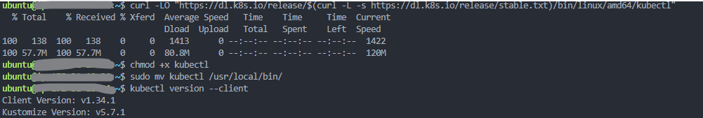

# Day 8: Container Orchestration & Kubernetes Fundamentals

## Learning Objectives
By the end of Day 8, you will master:
- Kubernetes cluster setup and architecture understanding
- Pod management and container orchestration
- Services and networking in Kubernetes
- ConfigMaps and Secrets management
- Deployments and scaling strategies
- Persistent storage in Kubernetes
- Basic monitoring and troubleshooting
- YAML manifest creation and management

---

## Prerequisites
- Completion of Day 7 (Docker fundamentals)
- Understanding of containerization concepts
- Basic YAML syntax knowledge
- Familiarity with networking concepts
- Linux command line proficiency

---

## Why Kubernetes Matters in Production

### The Container Orchestration Challenge
While Docker solves application packaging, production environments need:
- **High Availability**: Automatic failover and health monitoring
- **Scalability**: Dynamic scaling based on demand
- **Service Discovery**: Containers finding and communicating with each other
- **Load Balancing**: Traffic distribution across container instances
- **Rolling Updates**: Zero-downtime deployments
- **Resource Management**: Efficient CPU and memory allocation

### Real-World Usage Statistics
- **Google**: Runs 2 billion containers per week on Kubernetes
- **Spotify**: Manages 300+ microservices with Kubernetes
- **Airbnb**: Handles massive traffic spikes using K8s auto-scaling
- **Netflix**: Uses Kubernetes for stream processing infrastructure

---

## TASK 1: Kubernetes Cluster Setup & Architecture
**What you'll learn**: Set up a local Kubernetes cluster and understand core components

### Steps:
1. **Install kubectl (Kubernetes CLI)**:
   ```bash
   curl -LO "https://dl.k8s.io/release/$(curl -L -s https://dl.k8s.io/release/stable.txt)/bin/linux/amd64/kubectl"
   chmod +x kubectl
   sudo mv kubectl /usr/local/bin/
   kubectl version --client
   ```

2. **Install Minikube (Minikube Giving Error OF ME showing Memory chunk So I Install Kind ) for local development**:
   ```bash
   # Download Kind binary
    curl -Lo ./kind https://kind.sigs.k8s.io/dl/v0.24.0/kind-linux-amd64

  # Make it executable and move to /usr/local/bin
    chmod +x ./kind
    sudo mv ./kind /usr/local/bin/

  # Verify installation
    kind version
   ```

3. **Start your first Kubernetes cluster**:
   ```bash
   minikube start --driver=docker --cpus=2 --memory=4g
   minikube status
   kubectl cluster-info
   ```
   **Since we Install Kind Insted Of minikube so Our command shoul now**:
   ```# Create your first Kubernetes cluster with Kind
      kind create cluster

      # Check cluster status
      kubectl cluster-info
      kubectl get nodes
   ``` 

4. **Explore cluster components**:
   ```bash
   # View nodes
   kubectl get nodes
   kubectl describe node minikube
   
   # View system pods
   kubectl get pods -n kube-system
   
   # Check cluster components
   kubectl get componentstatuses
   ```

5. **Create cluster analysis script**:
   ```bash
   mkdir -p ~/devops-learning/day8
   cat > ~/devops-learning/day8/cluster_info.sh << 'EOF'
   #!/bin/bash
   # Kubernetes Cluster Information Script
   
   echo "=== KUBERNETES CLUSTER ANALYSIS ==="
   echo "Generated: $(date)"
   echo ""
   
   echo "=== CLUSTER INFORMATION ==="
   kubectl cluster-info
   echo ""
   
   echo "=== NODE STATUS ==="
   kubectl get nodes -o wide
   echo ""
   
   echo "=== SYSTEM COMPONENTS ==="
   kubectl get pods -n kube-system --sort-by=.metadata.name
   echo ""
   
   echo "=== CLUSTER RESOURCE USAGE ==="
   kubectl top nodes 2>/dev/null || echo "Metrics server not available"
   echo ""
   
   echo "=== NAMESPACES ==="
   kubectl get namespaces
   echo ""
   
   echo "=== KUBERNETES VERSION ==="
   kubectl version --short
   echo ""
   
   echo "=== ANALYSIS COMPLETE ==="
   EOF
   
   chmod +x ~/devops-learning/day8/cluster_info.sh
   ~/devops-learning/day8/cluster_info.sh
   ```


### Assessment Questions:
- How many nodes are in your cluster?

- Which system pods are running in kube-system namespace?

- What version of Kubernetes are you running?
Client Version: v1.34.1
Kustomize Version: v5.7.1
Server Version: v1.31.0
---

## TASK 2: Pod Management & Basic Workloads
**What you'll learn**: Create and manage Kubernetes pods

### Steps:
1. **Create your first pod manually**:
   ```bash
   # Create a simple nginx pod
   kubectl run nginx-pod --image=nginx:latest --port=80
   
   # Check pod status
   kubectl get pods
   kubectl describe pod nginx-pod
   ```

2. **Create pod using YAML manifest**:
   ```bash
   cat > ~/devops-learning/day8/simple-pod.yaml << 'EOF'
   apiVersion: v1
   kind: Pod
   metadata:
     name: devops-app-pod
     labels:
       app: devops-app
       environment: learning
   spec:
     containers:
     - name: web-server
       image: nginx:alpine
       ports:
       - containerPort: 80
       env:
       - name: ENVIRONMENT
         value: "development"
       resources:
         requests:
           memory: "64Mi"
           cpu: "50m"
         limits:
           memory: "128Mi"
           cpu: "100m"
     - name: sidecar-logger
       image: busybox
       command: ['sh', '-c', 'while true; do echo "$(date): Logging from sidecar"; sleep 30; done']
   EOF
   
   kubectl apply -f ~/devops-learning/day8/simple-pod.yaml
   kubectl get pods -l app=devops-app
   ```

3. **Expose and Access Pod (NodePort with Kind Port Mapping)**:
   ```bash
   # Create a Kind config with port mapping
   nano ~/kind-config.yaml
  #
  ```kind: Cluster
  apiVersion: kind.x-k8s.io/v1alpha4
  nodes:
  - role: control-plane
    extraPortMappings:
    - containerPort: 30080
      hostPort: 30080
      protocol: TCP

```
  # Recreate Kind cluster with this config
    kind delete cluster
   kind create cluster --config ~/kind-config.yaml

   nano ~/devops-learning/day8/nginx-nodeport.yaml

  # 
  apiVersion: v1
kind: Service
metadata:
  name: nginx-nodeport
spec:
  type: NodePort
  selector:
    app: devops-app
  ports:
    - port: 80
      targetPort: 80
      nodePort: 30080

  # Expose the pod using a NodePort service
  kubectl apply -f ~/devops-learning/day8/nginx-nodeport.yaml

  # Check service details
  kubectl get svc nginx-nodeport

  # Access from EC2 host
  curl http://localhost:30080

  # Access from browser (replace with your EC2 public IP)
  http://<EC2-PUBLIC-IP>:30080

   ```

4. **Create pod management script**:
   ```bash
   cat > ~/devops-learning/day8/pod_manager.sh << 'EOF'
   #!/bin/bash
   # Kubernetes Pod Management Script
   
   echo "=== KUBERNETES POD MANAGER ==="
   echo "1. List all pods"
   echo "2. Create test pod"
   echo "3. Pod logs viewer"
   echo "4. Execute command in pod"
   echo "5. Pod resource usage"
   echo "6. Delete pod"
   echo "7. Pod troubleshooting"
   echo ""
   
   read -p "Choose option (1-7): " choice
   
   case $choice in
       1)
           echo "=== ALL PODS ==="
           kubectl get pods --all-namespaces -o wide
           echo ""
           echo "=== POD STATUS SUMMARY ==="
           kubectl get pods --all-namespaces --field-selector=status.phase!=Running 2>/dev/null || echo "All pods running"
           ;;
       2)
           read -p "Pod name: " pod_name
           read -p "Image (default: nginx): " image
           image=${image:-nginx}
           kubectl run $pod_name --image=$image
           echo "Pod $pod_name created with image $image"
           ;;
       3)
           read -p "Pod name: " pod_name
           read -p "Container name (optional): " container
           if [ -z "$container" ]; then
               kubectl logs $pod_name --tail=20
           else
               kubectl logs $pod_name -c $container --tail=20
           fi
           ;;
       4)
           read -p "Pod name: " pod_name
           read -p "Command (default: /bin/sh): " cmd
           cmd=${cmd:-/bin/sh}
           kubectl exec -it $pod_name -- $cmd
           ;;
       5)
           echo "=== POD RESOURCE USAGE ==="
           kubectl top pods 2>/dev/null || echo "Metrics server not available"
           echo ""
           echo "=== POD RESOURCE REQUESTS/LIMITS ==="
           kubectl describe pods | grep -A 5 "Requests\|Limits"
           ;;
       6)
           read -p "Pod name to delete: " pod_name
           kubectl delete pod $pod_name
           echo "Pod $pod_name deleted"
           ;;
       7)
           echo "=== POD TROUBLESHOOTING ==="
           echo "Failed/Pending pods:"
           kubectl get pods --field-selector=status.phase!=Running
           echo ""
           echo "Recent events:"
           kubectl get events --sort-by=.metadata.creationTimestamp | tail -10
           ;;
       *)
           echo "Invalid option"
           ;;
   esac
   EOF
   
   chmod +x ~/devops-learning/day8/pod_manager.sh
   ```
   I using Nano GUI insted Of Cat For Save Ctrl +o and for exit ctrl +x


### Assessment Questions:
Q1. Can you access the nginx pod through port forwarding?

On my EC2 + Kind setup, kubectl port-forward was not reliable because common ports (8080/9090) were already occupied, and port-forward binds only to localhost, which isn’t reachable from the EC2 public IP.
✅ Instead, I exposed the pod using a NodePort service with Kind’s extraPortMappings, which mapped container port 80 to host port 30080.
This allowed me to access the nginx pod successfully in a browser via:
http://<EC2-PUBLIC-IP>:30080


Q2. What resources are your pods requesting and limiting?
From the simple-pod.yaml manifest:
web-server container (nginx:alpine)
Requests: 64Mi memory, 50m CPU
Limits: 128Mi memory, 100m CPU
sidecar-logger container (busybox)
No explicit resource requests or limits (defaults apply).

Q3. How many containers are running in your multi-container pod?

The devops-app-pod is a multi-container pod running 2 containers:
web-server → nginx frontend
sidecar-logger → simple logger loop

---

## TASK 3: Services & Networking
**What you'll learn**: Expose applications and manage service discovery

### Steps:
1. **Create different types of services**:
   ```bash
   # ClusterIP service (internal only)
   cat > ~/devops-learning/day8/clusterip-service.yaml << 'EOF'
   apiVersion: v1
   kind: Service
   metadata:
     name: nginx-clusterip
   spec:
     type: ClusterIP
     selector:
       app: nginx
     ports:
     - port: 80
       targetPort: 80
   ---
   apiVersion: apps/v1
   kind: Deployment
   metadata:
     name: nginx-deployment
   spec:
     replicas: 3
     selector:
       matchLabels:
         app: nginx
     template:
       metadata:
         labels:
           app: nginx
       spec:
         containers:
         - name: nginx
           image: nginx:alpine
           ports:
           - containerPort: 80
   EOF
   
   kubectl apply -f ~/devops-learning/day8/clusterip-service.yaml
   ```

2. **Create NodePort service for external access**:
   ```bash
   cat > ~/devops-learning/day8/nodeport-service.yaml << 'EOF'
   apiVersion: v1
   kind: Service
   metadata:
     name: nginx-nodeport
   spec:
     type: NodePort
     selector:
       app: nginx
     ports:
     - port: 80
       targetPort: 80
       nodePort: 30080
   EOF
   
   kubectl apply -f ~/devops-learning/day8/nodeport-service.yaml
   ```

3. **Test service connectivity**:
   ```bash
   # Check services
   kubectl get services
   
   # Test ClusterIP service from within cluster
   kubectl run test-pod --image=busybox -it --rm --restart=Never -- wget -qO- nginx-clusterip
   
   # Test NodePort service externally
   minikube service nginx-nodeport --url
   # Use the returned URL to test in browser or with curl
   ```

4. **Create network testing script**:
   ```bash
   cat > ~/devops-learning/day8/network_test.sh << 'EOF'
   #!/bin/bash
   # Kubernetes Network Testing Script
   
   echo "=== KUBERNETES NETWORK TESTING ==="
   echo ""
   
   echo "=== SERVICES ==="
   kubectl get services -o wide
   echo ""
   
   echo "=== ENDPOINTS ==="
   kubectl get endpoints
   echo ""
   
   echo "=== SERVICE CONNECTIVITY TEST ==="
   services=$(kubectl get services -o name | grep -v kubernetes)
   
   for service in $services; do
       service_name=$(echo $service | cut -d'/' -f2)
       echo "Testing service: $service_name"
       
       # Test from within cluster
       kubectl run network-test-$(date +%s) --image=busybox --rm -it --restart=Never -- \
           wget -qO- --timeout=5 $service_name 2>/dev/null && echo "  ✅ Internal connectivity: OK" || echo "  ❌ Internal connectivity: FAILED"
   done
   
   echo ""
   echo "=== DNS RESOLUTION TEST ==="
   kubectl run dns-test --image=busybox --rm -it --restart=Never -- \
       nslookup kubernetes.default.svc.cluster.local
   
   echo ""
   echo "=== NETWORK POLICIES ==="
   kubectl get networkpolicies --all-namespaces || echo "No network policies found"
   
   echo ""
   echo "=== NETWORK TESTING COMPLETE ==="
   EOF
   
   chmod +x ~/devops-learning/day8/network_test.sh
   ~/devops-learning/day8/network_test.sh
   ```

### Assessment Questions:
- Can you access the NodePort service from outside the cluster?
Yes 

- How many endpoints does your nginx service have?
3

- What's the ClusterIP assigned to your service?

---

## TASK 4: ConfigMaps and Secrets Management
**What you'll learn**: Manage configuration and sensitive data

### Steps:
1. **Create ConfigMaps for application configuration**:
   ```bash
   # Create ConfigMap from literal values
   kubectl create configmap app-config \
     --from-literal=database_host=mysql.default.svc.cluster.local \
     --from-literal=database_port=3306 \
     --from-literal=app_environment=production
   
   # Create ConfigMap from file
   cat > ~/devops-learning/day8/app.properties << 'EOF'
   server.port=8080
   server.servlet.context-path=/api
   logging.level.root=INFO
   spring.datasource.url=jdbc:mysql://mysql:3306/appdb
   spring.jpa.hibernate.ddl-auto=update
   EOF
   
   kubectl create configmap app-properties --from-file=~/devops-learning/day8/app.properties
   ```

2. **Create Secrets for sensitive information**:
   ```bash
   # Create secret from literal values
   kubectl create secret generic db-credentials \
     --from-literal=username=admin \
     --from-literal=password=secretpassword123
   
   # Create TLS secret
   openssl req -x509 -nodes -days 365 -newkey rsa:2048 \
     -keyout ~/devops-learning/day8/tls.key \
     -out ~/devops-learning/day8/tls.crt \
     -subj "/CN=devops-app.local"
   
   kubectl create secret tls app-tls-secret \
     --cert=~/devops-learning/day8/tls.crt \
     --key=~/devops-learning/day8/tls.key
   ```

3. **Use ConfigMaps and Secrets in pods**:
   ```bash
   cat > ~/devops-learning/day8/app-with-config.yaml << 'EOF'
   apiVersion: apps/v1
   kind: Deployment
   metadata:
     name: configured-app
   spec:
     replicas: 2
     selector:
       matchLabels:
         app: configured-app
     template:
       metadata:
         labels:
           app: configured-app
       spec:
         containers:
         - name: app
           image: nginx:alpine
           env:
           # Environment variables from ConfigMap
           - name: DATABASE_HOST
             valueFrom:
               configMapKeyRef:
                 name: app-config
                 key: database_host
           - name: DATABASE_PORT
             valueFrom:
               configMapKeyRef:
                 name: app-config
                 key: database_port
           # Environment variables from Secret
           - name: DB_USERNAME
             valueFrom:
               secretKeyRef:
                 name: db-credentials
                 key: username
           - name: DB_PASSWORD
             valueFrom:
               secretKeyRef:
                 name: db-credentials
                 key: password
           volumeMounts:
           # Mount ConfigMap as volume
           - name: config-volume
             mountPath: /app/config
           # Mount Secret as volume
           - name: secret-volume
             mountPath: /app/secrets
             readOnly: true
         volumes:
         - name: config-volume
           configMap:
             name: app-properties
         - name: secret-volume
           secret:
             secretName: db-credentials
             defaultMode: 0600
   EOF
   
   kubectl apply -f ~/devops-learning/day8/app-with-config.yaml
   ```

4. **Verify configuration injection**:
   ```bash
   # Check environment variables
   kubectl exec deployment/configured-app -- env | grep DATABASE
   
   # Check mounted files
   kubectl exec deployment/configured-app -- ls -la /app/config
   kubectl exec deployment/configured-app -- cat /app/config/app.properties
   
   # Check secret mounting (be careful with sensitive data)
   kubectl exec deployment/configured-app -- ls -la /app/secrets
   ```

5. **Create configuration management script**:
   ```bash
   cat > ~/devops-learning/day8/config_manager.sh << 'EOF'
   #!/bin/bash
   # Configuration Management Script
   
   echo "=== KUBERNETES CONFIGURATION MANAGER ==="
   echo "1. List ConfigMaps"
   echo "2. List Secrets"
   echo "3. Create ConfigMap"
   echo "4. Create Secret"
   echo "5. View ConfigMap content"
   echo "6. Update ConfigMap"
   echo "7. Configuration audit"
   echo ""
   
   read -p "Choose option (1-7): " choice
   
   case $choice in
       1)
           echo "=== CONFIGMAPS ==="
           kubectl get configmaps
           echo ""
           kubectl get configmaps -o custom-columns=NAME:.metadata.name,DATA:.data
           ;;
       2)
           echo "=== SECRETS ==="
           kubectl get secrets
           echo ""
           kubectl get secrets -o custom-columns=NAME:.metadata.name,TYPE:.type,DATA:.data
           ;;
       3)
           read -p "ConfigMap name: " cm_name
           read -p "Key: " key
           read -p "Value: " value
           kubectl create configmap $cm_name --from-literal=$key=$value
           echo "ConfigMap $cm_name created"
           ;;
       4)
           read -p "Secret name: " secret_name
           read -p "Key: " key
           read -p "Value: " value
           kubectl create secret generic $secret_name --from-literal=$key=$value
           echo "Secret $secret_name created"
           ;;
       5)
           read -p "ConfigMap name: " cm_name
           kubectl get configmap $cm_name -o yaml
           ;;
       6)
           read -p "ConfigMap name to update: " cm_name
           read -p "New key: " key
           read -p "New value: " value
           kubectl create configmap $cm_name --from-literal=$key=$value --dry-run=client -o yaml | kubectl apply -f -
           echo "ConfigMap $cm_name updated"
           ;;
       7)
           echo "=== CONFIGURATION AUDIT ==="
           echo "ConfigMaps in use:"
           kubectl get pods -o jsonpath='{range .items[*]}{.metadata.name}{"\t"}{range .spec.volumes[*]}{.configMap.name}{" "}{end}{"\n"}{end}' | grep -v "^$"
           echo ""
           echo "Secrets in use:"
           kubectl get pods -o jsonpath='{range .items[*]}{.metadata.name}{"\t"}{range .spec.volumes[*]}{.secret.secretName}{" "}{end}{"\n"}{end}' | grep -v "^$"
           ;;
       *)
           echo "Invalid option"
           ;;
   esac
   EOF
   
   chmod +x ~/devops-learning/day8/config_manager.sh
   ```

### Assessment Questions:
- Are the environment variables from ConfigMap visible in your pod?
- Can you see the mounted configuration files?
- How are secrets different from ConfigMaps in terms of storage?

---

## TASK 5: Deployments and Scaling
**What you'll learn**: Manage application deployments and handle scaling

### Steps:
1. **Create a comprehensive deployment**:
   ```bash
   cat > ~/devops-learning/day8/scalable-app.yaml << 'EOF'
   apiVersion: apps/v1
   kind: Deployment
   metadata:
     name: scalable-web-app
     labels:
       app: scalable-web-app
   spec:
     replicas: 3
     strategy:
       type: RollingUpdate
       rollingUpdate:
         maxUnavailable: 1
         maxSurge: 1
     selector:
       matchLabels:
         app: scalable-web-app
     template:
       metadata:
         labels:
           app: scalable-web-app
       spec:
         containers:
         - name: web-server
           image: nginx:alpine
           ports:
           - containerPort: 80
           resources:
             requests:
               memory: "64Mi"
               cpu: "50m"
             limits:
               memory: "128Mi"
               cpu: "100m"
           livenessProbe:
             httpGet:
               path: /
               port: 80
             initialDelaySeconds: 30
             periodSeconds: 10
           readinessProbe:
             httpGet:
               path: /
               port: 80
             initialDelaySeconds: 5
             periodSeconds: 5
   ---
   apiVersion: v1
   kind: Service
   metadata:
     name: scalable-web-service
   spec:
     type: LoadBalancer
     selector:
       app: scalable-web-app
     ports:
     - port: 80
       targetPort: 80
   EOF
   
   kubectl apply -f ~/devops-learning/day8/scalable-app.yaml
   ```

2. **Practice scaling operations**:
   ```bash
   # Manual scaling
   kubectl scale deployment scalable-web-app --replicas=5
   kubectl get pods -l app=scalable-web-app
   
   # Check rollout status
   kubectl rollout status deployment/scalable-web-app
   
   # Scale down
   kubectl scale deployment scalable-web-app --replicas=2
   ```

3. **Perform rolling updates**:
   ```bash
   # Update image version
   kubectl set image deployment/scalable-web-app web-server=nginx:1.21-alpine
   
   # Watch rollout
   kubectl rollout status deployment/scalable-web-app
   
   # Check rollout history
   kubectl rollout history deployment/scalable-web-app
   
   # Rollback if needed
   kubectl rollout undo deployment/scalable-web-app
   ```

4. **Implement Horizontal Pod Autoscaler**:
   ```bash
   # Create HPA (requires metrics server)
   kubectl autoscale deployment scalable-web-app --cpu-percent=70 --min=2 --max=10
   
   # Check HPA status
   kubectl get hpa
   kubectl describe hpa scalable-web-app
   ```

5. **Create deployment management script**:
   ```bash
   cat > ~/devops-learning/day8/deployment_manager.sh << 'EOF'
   #!/bin/bash
   # Deployment Management Script
   
   echo "=== KUBERNETES DEPLOYMENT MANAGER ==="
   echo "1. List deployments"
   echo "2. Scale deployment"
   echo "3. Update deployment image"
   echo "4. Rollback deployment"
   echo "5. Deployment status"
   echo "6. Create HPA"
   echo "7. Load test simulation"
   echo ""
   
   read -p "Choose option (1-7): " choice
   
   case $choice in
       1)
           echo "=== DEPLOYMENTS ==="
           kubectl get deployments -o wide
           echo ""
           echo "=== REPLICA SETS ==="
           kubectl get replicasets
           ;;
       2)
           read -p "Deployment name: " deployment
           read -p "Number of replicas: " replicas
           kubectl scale deployment $deployment --replicas=$replicas
           echo "Deployment $deployment scaled to $replicas replicas"
           kubectl rollout status deployment/$deployment
           ;;
       3)
           read -p "Deployment name: " deployment
           read -p "Container name: " container
           read -p "New image: " image
           kubectl set image deployment/$deployment $container=$image
           echo "Deployment $deployment updated with image $image"
           kubectl rollout status deployment/$deployment
           ;;
       4)
           read -p "Deployment name: " deployment
           kubectl rollout undo deployment/$deployment
           echo "Deployment $deployment rolled back"
           kubectl rollout status deployment/$deployment
           ;;
       5)
           read -p "Deployment name: " deployment
           echo "=== DEPLOYMENT STATUS ==="
           kubectl get deployment $deployment
           echo ""
           echo "=== ROLLOUT HISTORY ==="
           kubectl rollout history deployment/$deployment
           echo ""
           echo "=== POD STATUS ==="
           kubectl get pods -l app=$deployment
           ;;
       6)
           read -p "Deployment name: " deployment
           read -p "CPU threshold (default 70): " cpu
           cpu=${cpu:-70}
           read -p "Min replicas (default 2): " min
           min=${min:-2}
           read -p "Max replicas (default 10): " max
           max=${max:-10}
           kubectl autoscale deployment $deployment --cpu-percent=$cpu --min=$min --max=$max
           echo "HPA created for deployment $deployment"
           ;;
       7)
           echo "=== LOAD TEST SIMULATION ==="
           echo "Creating load generator pod..."
           kubectl run load-generator --image=busybox --rm -it --restart=Never -- \
             /bin/sh -c "while true; do wget -q -O- http://scalable-web-service; done"
           ;;
       *)
           echo "Invalid option"
           ;;
   esac
   EOF
   
   chmod +x ~/devops-learning/day8/deployment_manager.sh
   ```


### Assessment Questions:
- How long did the rolling update take to complete?

- Did the Horizontal Pod Autoscaler create additional pods during load testing?
Not yet (CPU at 0%). After load generation, it should.
- What's the difference between a Deployment and ReplicaSet?
A ReplicaSet ensures a fixed number of pod replicas.

A Deployment manages ReplicaSets and provides declarative updates, rollouts, and rollbacks.

---

## TASK 6: Persistent Storage
**What you'll learn**: Manage stateful applications with persistent volumes

### Steps:
1. **Create PersistentVolume and PersistentVolumeClaim**:
   ```bash
   cat > ~/devops-learning/day8/persistent-storage.yaml << 'EOF'
   # PersistentVolume
   apiVersion: v1
   kind: PersistentVolume
   metadata:
     name: local-storage-pv
   spec:
     capacity:
       storage: 1Gi
     accessModes:
     - ReadWriteOnce
     persistentVolumeReclaimPolicy: Retain
     storageClassName: local-storage
     local:
       path: /tmp/k8s-local-storage
     nodeAffinity:
       required:
         nodeSelectorTerms:
         - matchExpressions:
           - key: kubernetes.io/hostname
             operator: In
             values:
             - minikube
   ---
   # PersistentVolumeClaim
   apiVersion: v1
   kind: PersistentVolumeClaim
   metadata:
     name: app-storage-claim
   spec:
     accessModes:
     - ReadWriteOnce
     resources:
       requests:
         storage: 500Mi
     storageClassName: local-storage
   EOF
   
   # Create directory on minikube node
   minikube ssh 'sudo mkdir -p /tmp/k8s-local-storage && sudo chmod 777 /tmp/k8s-local-storage'
   
   kubectl apply -f ~/devops-learning/day8/persistent-storage.yaml
   kubectl get pv,pvc
   ```

2. **Deploy stateful application with persistent storage**:
   ```bash
   cat > ~/devops-learning/day8/stateful-app.yaml << 'EOF'
   apiVersion: apps/v1
   kind: Deployment
   metadata:
     name: mysql-deployment
   spec:
     replicas: 1
     selector:
       matchLabels:
         app: mysql
     template:
       metadata:
         labels:
           app: mysql
       spec:
         containers:
         - name: mysql
           image: mysql:8.0
           env:
           - name: MYSQL_ROOT_PASSWORD
             value: "rootpassword"
           - name: MYSQL_DATABASE
             value: "testdb"
           - name: MYSQL_USER
             value: "testuser"
           - name: MYSQL_PASSWORD
             value: "testpass"
           ports:
           - containerPort: 3306
           volumeMounts:
           - name: mysql-storage
             mountPath: /var/lib/mysql
           resources:
             requests:
               memory: "256Mi"
               cpu: "100m"
             limits:
               memory: "512Mi"
               cpu: "200m"
         volumes:
         - name: mysql-storage
           persistentVolumeClaim:
             claimName: app-storage-claim
   ---
   apiVersion: v1
   kind: Service
   metadata:
     name: mysql-service
   spec:
     selector:
       app: mysql
     ports:
     - port: 3306
       targetPort: 3306
     type: ClusterIP
   EOF
   
   kubectl apply -f ~/devops-learning/day8/stateful-app.yaml
   ```

3. **Test data persistence**:
   ```bash
   # Wait for MySQL to be ready
   kubectl wait --for=condition=ready pod -l app=mysql --timeout=300s
   
   # Connect to MySQL and create test data
   kubectl exec deployment/mysql-deployment -- mysql -u root -prootpassword -e "
   CREATE TABLE testdb.users (id INT PRIMARY KEY, name VARCHAR(50));
   INSERT INTO testdb.users VALUES (1, 'John Doe'), (2, 'Jane Smith');
   SELECT * FROM testdb.users;"
   
   # Delete and recreate pod to test persistence
   kubectl delete pod -l app=mysql
   kubectl wait --for=condition=ready pod -l app=mysql --timeout=300s
   
   # Verify data survived pod restart
   kubectl exec deployment/mysql-deployment -- mysql -u root -prootpassword -e "SELECT * FROM testdb.users;"
   ```

4. **Create storage management script**:
   ```bash
   cat > ~/devops-learning/day8/storage_manager.sh << 'EOF'
   #!/bin/bash
   # Storage Management Script
   
   echo "=== KUBERNETES STORAGE MANAGER ==="
   echo "1. List storage resources"
   echo "2. Create PVC"
   echo "3. Storage usage analysis"
   echo "4. Backup PV data"
   echo "5. Storage troubleshooting"
   echo ""
   
   read -p "Choose option (1-5): " choice
   
   case $choice in
       1)
           echo "=== PERSISTENT VOLUMES ==="
           kubectl get pv
           echo ""
           echo "=== PERSISTENT VOLUME CLAIMS ==="
           kubectl get pvc
           echo ""
           echo "=== STORAGE CLASSES ==="
           kubectl get storageclass
           ;;
       2)
           read -p "PVC name: " pvc_name
           read -p "Storage size (e.g., 1Gi): " size
           read -p "Access mode (ReadWriteOnce/ReadWriteMany/ReadOnlyMany): " access_mode
           access_mode=${access_mode:-ReadWriteOnce}
           
           cat > /tmp/pvc-$pvc_name.yaml << EOF
   apiVersion: v1
   kind: PersistentVolumeClaim
   metadata:
     name: $pvc_name
   spec:
     accessModes:
     - $access_mode
     resources:
       requests:
         storage: $size
   EOF
           kubectl apply -f /tmp/pvc-$pvc_name.yaml
           echo "PVC $pvc_name created"
           ;;
       3)
           echo "=== STORAGE USAGE ANALYSIS ==="
           echo "PV Status:"
           kubectl get pv -o custom-columns=NAME:.metadata.name,CAPACITY:.spec.capacity.storage,STATUS:.status.phase,CLAIM:.spec.claimRef.name
           echo ""
           echo "PVC Usage:"
           kubectl get pvc -o custom-columns=NAME:.metadata.name,STATUS:.status.phase,VOLUME:.spec.volumeName,CAPACITY:.status.capacity.storage
           echo ""
           echo "Pod Volume Mounts:"
           kubectl get pods -o jsonpath='{range .items[*]}{.metadata.name}{"\t"}{range .spec.volumes[*]}{.persistentVolumeClaim.claimName}{" "}{end}{"\n"}{end}' | grep -v "^.*\t$"
           ;;
       4)
           read -p "PVC name to backup: " pvc_name
           backup_job="backup-$(date +%s)"
           cat > /tmp/$backup_job.yaml << EOF
   apiVersion: batch/v1
   kind: Job
   metadata:
     name: $backup_job
   spec:
     template:
       spec:
         containers:
         - name: backup
           image: busybox
           command: ['tar', 'czf', '/backup/data-backup.tar.gz', '-C', '/data', '.']
           volumeMounts:
           - name: data-volume
             mountPath: /data
           - name: backup-volume
             mountPath: /backup
         volumes:
         - name: data-volume
           persistentVolumeClaim:
             claimName: $pvc_name
         - name: backup-volume
           hostPath:
             path: /tmp/k8s-backups
         restartPolicy: Never
   EOF
           kubectl apply -f /tmp/$backup_job.yaml
           echo "Backup job $backup_job created for PVC $pvc_name"
           ;;
       5)
           echo "=== STORAGE TROUBLESHOOTING ==="
           echo "PVCs in Pending state:"
           kubectl get pvc --field-selector=status.phase=Pending
           echo ""
           echo "Pods with volume mount issues:"
           kubectl get pods --field-selector=status.phase!=Running -o wide
           echo ""
           echo "Recent storage events:"
           kubectl get events --field-selector involvedObject.kind=PersistentVolumeClaim | head -10
           ;;
       *)
           echo "Invalid option"
           ;;
   esac
   EOF
   
   chmod +x ~/devops-learning/day8/storage_manager.sh
   ```

### Assessment Questions:
- Did your data survive the pod restart?
- What's the difference between PersistentVolume and PersistentVolumeClaim?
- How much storage is currently being used by your applications?

---

## TASK 7: Monitoring and Observability
**What you'll learn**: Monitor Kubernetes cluster and applications

### Steps:
1. **Deploy metrics server**:
   ```bash
   # Install metrics server for resource monitoring
   kubectl apply -f https://github.com/kubernetes-sigs/metrics-server/releases/latest/download/components.yaml
   
   # For Minikube, patch metrics server to work with self-signed certificates
   kubectl patch deployment metrics-server -n kube-system --type='json' -p='[
     {
       "op": "add",
       "path": "/spec/template/spec/containers/0/args/-",
       "value": "--kubelet-insecure-tls"
     }
   ]'
   
   # Wait for metrics server to be ready
   kubectl wait --for=condition=ready pod -l k8s-app=metrics-server -n kube-system --timeout=300s
   ```

2. **Monitor resource usage**:
   ```bash
   # Check node resource usage
   kubectl top nodes
   
   # Check pod resource usage
   kubectl top pods --all-namespaces
   
   # Monitor specific namespace
   kubectl top pods -n default
   ```

3. **Deploy monitoring stack**:
   ```bash
   cat > ~/devops-learning/day8/monitoring-stack.yaml << 'EOF'
   # Prometheus ConfigMap
   apiVersion: v1
   kind: ConfigMap
   metadata:
     name: prometheus-config
   data:
     prometheus.yml: |
       global:
         scrape_interval: 15s
       scrape_configs:
       - job_name: 'kubernetes-pods'
         kubernetes_sd_configs:
         - role: pod
         relabel_configs:
         - source_labels: [__meta_kubernetes_pod_annotation_prometheus_io_scrape]
           action: keep
           regex: true
         - source_labels: [__meta_kubernetes_pod_annotation_prometheus_io_path]
           action: replace
           target_label: __metrics_path__
           regex: (.+)
   ---
   # Prometheus Deployment
   apiVersion: apps/v1
   kind: Deployment
   metadata:
     name: prometheus
   spec:
     replicas: 1
     selector:
       matchLabels:
         app: prometheus
     template:
       metadata:
         labels:
           app: prometheus
       spec:
         containers:
         - name: prometheus
           image: prom/prometheus:latest
           ports:
           - containerPort: 9090
           volumeMounts:
           - name: config-volume
             mountPath: /etc/prometheus
           args:
           - '--config.file=/etc/prometheus/prometheus.yml'
           - '--storage.tsdb.path=/prometheus/'
           - '--web.console.libraries=/etc/prometheus/console_libraries'
           - '--web.console.templates=/etc/prometheus/consoles'
         volumes:
         - name: config-volume
           configMap:
             name: prometheus-config
   ---
   # Prometheus Service
   apiVersion: v1
   kind: Service
   metadata:
     name: prometheus-service
   spec:
     selector:
       app: prometheus
     type: NodePort
     ports:
     - port: 9090
       targetPort: 9090
       nodePort: 30090
   EOF
   
   kubectl apply -f ~/devops-learning/day8/monitoring-stack.yaml
   ```

4. **Create comprehensive monitoring script**:
   ```bash
   cat > ~/devops-learning/day8/cluster_monitor.sh << 'EOF'
   #!/bin/bash
   # Comprehensive Cluster Monitoring
   
   echo "=== KUBERNETES CLUSTER MONITORING ==="
   echo "Generated: $(date)"
   echo ""
   
   echo "=== CLUSTER HEALTH ==="
   kubectl get nodes -o wide
   echo ""
   kubectl get componentstatuses 2>/dev/null || echo "Component status not available"
   echo ""
   
   echo "=== RESOURCE USAGE ==="
   echo "Node resource usage:"
   kubectl top nodes 2>/dev/null || echo "Metrics server not available"
   echo ""
   echo "Pod resource usage (top 10):"
   kubectl top pods --all-namespaces --sort-by=cpu | head -11
   echo ""
   
   echo "=== WORKLOAD STATUS ==="
   echo "Deployments:"
   kubectl get deployments --all-namespaces
   echo ""
   echo "Services:"
   kubectl get services --all-namespaces
   echo ""
   echo "Pod status summary:"
   kubectl get pods --all-namespaces --field-selector=status.phase!=Running 2>/dev/null || echo "All pods running"
   echo ""
   
   echo "=== STORAGE STATUS ==="
   kubectl get pv,pvc --all-namespaces
   echo ""
   
   echo "=== NETWORK STATUS ==="
   kubectl get services --all-namespaces -o wide
   echo ""
   kubectl get ingress --all-namespaces 2>/dev/null || echo "No ingress resources found"
   echo ""
   
   echo "=== EVENTS (Recent Issues) ==="
   kubectl get events --sort-by=.metadata.creationTimestamp --all-namespaces | tail -10
   echo ""
   
   echo "=== SECURITY STATUS ==="
   echo "Service accounts:"
   kubectl get serviceaccounts --all-namespaces | wc -l
   echo ""
   echo "Secrets count:"
   kubectl get secrets --all-namespaces | wc -l
   echo ""
   
   echo "=== CAPACITY PLANNING ==="
   echo "Cluster capacity:"
   kubectl describe nodes | grep -E "Name:|cpu:|memory:" | grep -A2 "Name:"
   echo ""
   
   echo "=== MONITORING COMPLETE ==="
   EOF
   
   chmod +x ~/devops-learning/day8/cluster_monitor.sh
   ~/devops-learning/day8/cluster_monitor.sh
   ```

5. **Set up alerting simulation**:
   ```bash
   cat > ~/devops-learning/day8/alert_simulator.sh << 'EOF'
   #!/bin/bash
   # Alert Simulation Script
   
   echo "=== KUBERNETES ALERT SIMULATOR ==="
   echo "1. Simulate high CPU usage"
   echo "2. Simulate memory pressure"
   echo "3. Simulate pod crash loop"
   echo "4. Simulate network issues"
   echo "5. Check cluster health"
   echo ""
   
   read -p "Choose simulation (1-5): " choice
   
   case $choice in
       1)
           echo "Creating CPU stress pod..."
           kubectl run cpu-stress --image=progrium/stress --rm -it --restart=Never -- stress --cpu 2 --timeout 60s
           ;;
       2)
           echo "Creating memory stress pod..."
           kubectl run memory-stress --image=progrium/stress --rm -it --restart=Never -- stress --vm 1 --vm-bytes 256M --timeout 60s
           ;;
       3)
           echo "Creating crash loop pod..."
           kubectl run crash-loop --image=busybox --restart=Always -- sh -c "exit 1"
           echo "Check with: kubectl get pods crash-loop"
           echo "Clean up with: kubectl delete pod crash-loop"
           ;;
       4)
           echo "Creating network test pod..."
           kubectl run network-test --image=busybox --rm -it --restart=Never -- sh -c "ping -c 5 invalid-hostname.example.com || echo 'Network test completed'"
           ;;
       5)
           echo "=== CLUSTER HEALTH CHECK ==="
           kubectl get nodes
           kubectl get pods --all-namespaces --field-selector=status.phase!=Running
           kubectl top nodes 2>/dev/null || echo "Metrics not available"
           ;;
       *)
           echo "Invalid option"
           ;;
   esac
   EOF
   
   chmod +x ~/devops-learning/day8/alert_simulator.sh
   ```

### Assessment Questions:
- Can you see resource usage metrics for nodes and pods?
- What happens when you simulate high CPU usage?
- Are there any unhealthy pods or nodes in your cluster?

---

## TASK 8: Troubleshooting and Debugging
**What you'll learn**: Debug common Kubernetes issues and problems

### Steps:
1. **Create troubleshooting toolkit**:
   ```bash
   cat > ~/devops-learning/day8/debug_toolkit.sh << 'EOF'
   #!/bin/bash
   # Kubernetes Debug Toolkit
   
   echo "=== KUBERNETES DEBUG TOOLKIT ==="
   echo "1. Pod troubleshooting"
   echo "2. Service connectivity debug"
   echo "3. Resource investigation"
   echo "4. Log analysis"
   echo "5. Network debugging"
   echo "6. Performance analysis"
   echo "7. Security audit"
   echo ""
   
   read -p "Choose debug option (1-7): " choice
   
   case $choice in
       1)
           read -p "Pod name (or partial name): " pod_name
           echo "=== POD DEBUGGING ==="
           kubectl get pods | grep $pod_name
           echo ""
           echo "Pod details:"
           kubectl describe pod $pod_name
           echo ""
           echo "Pod logs:"
           kubectl logs $pod_name --tail=20
           echo ""
           echo "Previous container logs (if restarted):"
           kubectl logs $pod_name --previous --tail=20 2>/dev/null || echo "No previous logs"
           ;;
       2)
           read -p "Service name: " service_name
           echo "=== SERVICE DEBUGGING ==="
           kubectl get service $service_name
           echo ""
           echo "Service endpoints:"
           kubectl get endpoints $service_name
           echo ""
           echo "Testing connectivity:"
           kubectl run debug-$RANDOM --image=busybox --rm -it --restart=Never -- \
             wget -qO- --timeout=10 $service_name || echo "Connection failed"
           ;;
       3)
           echo "=== RESOURCE INVESTIGATION ==="
           echo "Resource quotas:"
           kubectl get resourcequota --all-namespaces
           echo ""
           echo "Limit ranges:"
           kubectl get limitrange --all-namespaces
           echo ""
           echo "Pod resource usage:"
           kubectl top pods --all-namespaces --sort-by=memory | head -10
           ;;
       4)
           read -p "Resource type (pod/deployment/service): " resource_type
           read -p "Resource name: " resource_name
           echo "=== LOG ANALYSIS ==="
           case $resource_type in
               pod)
                   kubectl logs $resource_name --all-containers=true
                   ;;
               deployment)
                   kubectl logs deployment/$resource_name
                   ;;
               *)
                   echo "Log analysis not available for $resource_type"
                   ;;
           esac
           ;;
       5)
           echo "=== NETWORK DEBUGGING ==="
           echo "Network policies:"
           kubectl get networkpolicies --all-namespaces
           echo ""
           echo "DNS test:"
           kubectl run dns-debug-$RANDOM --image=busybox --rm -it --restart=Never -- \
             nslookup kubernetes.default.svc.cluster.local
           echo ""
           echo "Service connectivity matrix:"
           services=$(kubectl get services -o name | head -5)
           for service in $services; do
               service_name=$(echo $service | cut -d'/' -f2)
               echo "Testing $service_name:"
               kubectl run net-test-$RANDOM --image=busybox --rm --restart=Never -- \
                 wget -qO- --timeout=5 $service_name >/dev/null 2>&1 && echo "  ✅ Reachable" || echo "  ❌ Unreachable"
           done
           ;;
       6)
           echo "=== PERFORMANCE ANALYSIS ==="
           echo "Node performance:"
           kubectl top nodes 2>/dev/null || echo "Metrics not available"
           echo ""
           echo "Resource-intensive pods:"
           kubectl top pods --all-namespaces --sort-by=cpu | head -10
           echo ""
           echo "Pod restart count:"
           kubectl get pods --all-namespaces -o custom-columns=NAME:.metadata.name,RESTARTS:.status.containerStatuses[0].restartCount --sort-by=.status.containerStatuses[0].restartCount
           ;;
       7)
           echo "=== SECURITY AUDIT ==="
           echo "Pods running as root:"
           kubectl get pods --all-namespaces -o jsonpath='{range .items[*]}{.metadata.name}{"\t"}{.spec.securityContext.runAsUser}{"\n"}{end}' | grep -E "\t$|\t0$" || echo "No pods found running as root"
           echo ""
           echo "Privileged pods:"
           kubectl get pods --all-namespaces -o jsonpath='{range .items[*]}{.metadata.name}{"\t"}{.spec.containers[0].securityContext.privileged}{"\n"}{end}' | grep true || echo "No privileged pods found"
           echo ""
           echo "Service accounts:"
           kubectl get serviceaccounts --all-namespaces
           ;;
       *)
           echo "Invalid option"
           ;;
   esac
   EOF
   
   chmod +x ~/devops-learning/day8/debug_toolkit.sh
   ```

2. **Create common issue scenarios for practice**:
   ```bash
   cat > ~/devops-learning/day8/create_issues.sh << 'EOF'
   #!/bin/bash
   # Create Common Issues for Troubleshooting Practice
   
   echo "=== CREATING TROUBLESHOOTING SCENARIOS ==="
   echo "1. Create failing pod"
   echo "2. Create resource-constrained pod"
   echo "3. Create network connectivity issue"
   echo "4. Create configuration problem"
   echo "5. Clean up all issues"
   echo ""
   
   read -p "Choose scenario (1-5): " choice
   
   case $choice in
       1)
           kubectl run failing-pod --image=busybox --restart=Always -- sh -c "exit 1"
           echo "Created failing pod. Debug with: kubectl describe pod failing-pod"
           ;;
       2)
           cat > /tmp/resource-issue.yaml << 'EOF'
   apiVersion: v1
   kind: Pod
   metadata:
     name: resource-hungry
   spec:
     containers:
     - name: app
       image: nginx
       resources:
         requests:
           memory: "10Gi"
           cpu: "8"
   EOF
           kubectl apply -f /tmp/resource-issue.yaml
           echo "Created resource-constrained pod. Check with: kubectl describe pod resource-hungry"
           ;;
       3)
           kubectl run network-issue --image=busybox --restart=Never -- \
             wget -qO- http://non-existent-service.default.svc.cluster.local
           echo "Created network connectivity issue. Check logs: kubectl logs network-issue"
           ;;
       4)
           cat > /tmp/config-issue.yaml << 'EOF'
   apiVersion: v1
   kind: Pod
   metadata:
     name: config-problem
   spec:
     containers:
     - name: app
       image: nginx
       env:
       - name: REQUIRED_CONFIG
         valueFrom:
           configMapKeyRef:
             name: non-existent-config
             key: missing-key
   EOF
           kubectl apply -f /tmp/config-issue.yaml
           echo "Created configuration issue. Debug with: kubectl describe pod config-problem"
           ;;
       5)
           kubectl delete pod failing-pod resource-hungry network-issue config-problem 2>/dev/null || echo "Some pods may not exist"
           echo "Cleaned up troubleshooting scenarios"
           ;;
       *)
           echo "Invalid option"
           ;;
   esac
   EOF
   
   chmod +x ~/devops-learning/day8/create_issues.sh
   ```

3. **Final cluster cleanup script**:
   ```bash
   cat > ~/devops-learning/day8/cleanup_cluster.sh << 'EOF'
   #!/bin/bash
   # Kubernetes Cluster Cleanup
   
   echo "=== KUBERNETES CLUSTER CLEANUP ==="
   echo "WARNING: This will delete resources created during Day 8 exercises"
   echo ""
   
   read -p "Are you sure you want to cleanup? (y/N): " confirm
   
   if [[ $confirm == [yY] || $confirm == [yY][eE][sS] ]]; then
       echo "Cleaning up Day 8 resources..."
       
       # Delete deployments
       kubectl delete deployment nginx-deployment scalable-web-app configured-app mysql-deployment prometheus 2>/dev/null || echo "Some deployments may not exist"
       
       # Delete services
       kubectl delete service nginx-clusterip nginx-nodeport scalable-web-service mysql-service prometheus-service 2>/dev/null || echo "Some services may not exist"
       
       # Delete pods
       kubectl delete pod nginx-pod devops-app-pod 2>/dev/null || echo "Some pods may not exist"
       
       # Delete configmaps and secrets
       kubectl delete configmap app-config app-properties prometheus-config 2>/dev/null || echo "Some configmaps may not exist"
       kubectl delete secret db-credentials app-tls-secret 2>/dev/null || echo "Some secrets may not exist"
       
       # Delete PVC and PV
       kubectl delete pvc app-storage-claim 2>/dev/null || echo "PVC may not exist"
       kubectl delete pv local-storage-pv 2>/dev/null || echo "PV may not exist"
       
       # Delete HPA
       kubectl delete hpa scalable-web-app 2>/dev/null || echo "HPA may not exist"
       
       echo ""
       echo "✅ Cleanup completed!"
       echo "Remaining resources:"
       kubectl get all
   else
       echo "Cleanup cancelled"
   fi
   EOF
   
   chmod +x ~/devops-learning/day8/cleanup_cluster.sh
   ```

### Assessment Questions:
- Can you successfully debug a failing pod using the debug toolkit?
- What are the most common causes of pod failures you encountered?
- How do you distinguish between configuration issues and resource constraints?

---

## Day 8 Final Challenge: Complete Kubernetes Application Stack

### Create a Production-Ready Microservices Application:

```bash
mkdir -p ~/devops-learning/day8/final-challenge
cd ~/devops-learning/day8/final-challenge

cat > complete-stack.yaml << 'EOF'
# Namespace
apiVersion: v1
kind: Namespace
metadata:
  name: microservices-stack
---
# Frontend Deployment
apiVersion: apps/v1
kind: Deployment
metadata:
  name: frontend
  namespace: microservices-stack
spec:
  replicas: 3
  selector:
    matchLabels:
      app: frontend
  template:
    metadata:
      labels:
        app: frontend
    spec:
      containers:
      - name: frontend
        image: nginx:alpine
        ports:
        - containerPort: 80
        resources:
          requests:
            memory: "64Mi"
            cpu: "50m"
          limits:
            memory: "128Mi"
            cpu: "100m"
---
# Backend API Deployment
apiVersion: apps/v1
kind: Deployment
metadata:
  name: backend-api
  namespace: microservices-stack
spec:
  replicas: 2
  selector:
    matchLabels:
      app: backend-api
  template:
    metadata:
      labels:
        app: backend-api
    spec:
      containers:
      - name: api
        image: node:alpine
        ports:
        - containerPort: 3000
        env:
        - name: REDIS_URL
          value: "redis://redis-service:6379"
---
# Redis Cache
apiVersion: apps/v1
kind: Deployment
metadata:
  name: redis
  namespace: microservices-stack
spec:
  replicas: 1
  selector:
    matchLabels:
      app: redis
  template:
    metadata:
      labels:
        app: redis
    spec:
      containers:
      - name: redis
        image: redis:alpine
        ports:
        - containerPort: 6379
---
# Services
apiVersion: v1
kind: Service
metadata:
  name: frontend-service
  namespace: microservices-stack
spec:
  selector:
    app: frontend
  type: LoadBalancer
  ports:
  - port: 80
    targetPort: 80
---
apiVersion: v1
kind: Service
metadata:
  name: backend-service
  namespace: microservices-stack
spec:
  selector:
    app: backend-api
  ports:
  - port: 3000
    targetPort: 3000
---
apiVersion: v1
kind: Service
metadata:
  name: redis-service
  namespace: microservices-stack
spec:
  selector:
    app: redis
  ports:
  - port: 6379
    targetPort: 6379
---
# Horizontal Pod Autoscaler
apiVersion: autoscaling/v2
kind: HorizontalPodAutoscaler
metadata:
  name: frontend-hpa
  namespace: microservices-stack
spec:
  scaleTargetRef:
    apiVersion: apps/v1
    kind: Deployment
    name: frontend
  minReplicas: 2
  maxReplicas: 10
  metrics:
  - type: Resource
    resource:
      name: cpu
      target:
        type: Utilization
        averageUtilization: 70
EOF

kubectl apply -f complete-stack.yaml
```

### Final Assessment:
- Deploy the complete microservices stack
- Verify all components are communicating
- Test auto-scaling functionality
- Implement monitoring for the entire stack
- Demonstrate rolling updates with zero downtime

---

## Day 8 Summary

### Skills Mastered:
- ✅ Kubernetes cluster setup and management
- ✅ Pod lifecycle and container orchestration
- ✅ Service discovery and networking
- ✅ Configuration management with ConfigMaps/Secrets
- ✅ Deployment strategies and scaling
- ✅ Persistent storage management
- ✅ Monitoring and observability
- ✅ Troubleshooting and debugging

### Production Readiness Checklist:
- [ ] Resource requests and limits configured
- [ ] Health checks implemented
- [ ] Persistent storage for stateful applications
- [ ] Monitoring and logging setup
- [ ] Auto-scaling configured
- [ ] Security policies implemented
- [ ] Backup and disaster recovery procedures
- [ ] Network policies for isolation

### Real-World Applications:
- **Microservices orchestration** at enterprise scale
- **CI/CD pipeline integration** with automated deployments
- **Multi-cloud deployments** with vendor flexibility
- **Auto-scaling** based on traffic patterns
- **Zero-downtime updates** for critical applications

### Next Steps (Day 9 Preview):
- Advanced Kubernetes concepts (Operators, CRDs)
- Service mesh implementation (Istio/Linkerd)
- GitOps and continuous deployment
- Multi-cluster management

Congratulations! You've mastered Kubernetes fundamentals and are ready for production container orchestration challenges.