# Day 9: Database Administration & Management

## Learning Objectives
By the end of Day 9, you will master:
- MySQL/PostgreSQL installation and configuration
- Database creation and management
- User permissions and security
- Backup and recovery strategies
- Performance monitoring and optimization
- Replication setup (master-slave)
- Database automation scripts
- Query optimization basics

---

## Prerequisites
- Completion of Days 1-8
- Understanding of file systems and permissions
- Basic SQL knowledge (helpful but not required)
- Command-line proficiency
- Understanding of network services

---

## Why Database Administration Matters

### The Data Foundation
Modern applications depend on reliable database infrastructure:
- **Data Persistence**: Store and retrieve application data
- **Transaction Integrity**: ACID compliance for data consistency
- **Performance**: Optimized query execution for fast responses
- **High Availability**: Replication and failover for uptime
- **Security**: Protecting sensitive user and business data
- **Scalability**: Handle growing data volumes efficiently

### Real-World Impact
- **E-commerce**: Product catalogs, orders, customer data
- **Financial Services**: Transactions, account balances, audit trails
- **Healthcare**: Patient records, medical history, compliance
- **Social Media**: User profiles, posts, relationships, messaging

---

## TASK 1: MySQL Installation & Configuration
**What you'll learn**: Install and configure MySQL database server

### Steps:
1. **Install MySQL server**:
   ```bash
   # Update package repository
   sudo apt update
   
   # Install MySQL server
   sudo apt install mysql-server -y
   
   # Check MySQL version
   mysql --version
   ```
   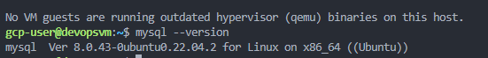

2. **Secure MySQL installation**:
   ```bash
   # Run security script
   sudo mysql_secure_installation
   
   # Follow prompts:
   # - Set root password
   # - Remove anonymous users (Yes)
   # - Disallow root login remotely (Yes)
   # - Remove test database (Yes)
   # - Reload privilege tables (Yes)
   ```
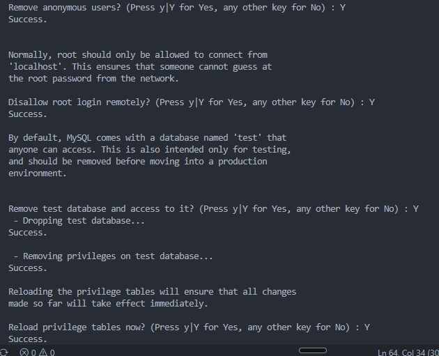
3. **Check MySQL service status**:
   ```bash
   # Check if MySQL is running
   sudo systemctl status mysql
   
   # If not running, start it
   sudo systemctl start mysql
   
   # Enable on boot
   sudo systemctl enable mysql
   ```

4. **Initial MySQL connection**:
   ```bash
   # Connect as root
   sudo mysql -u root -p
   
   # Inside MySQL prompt, check databases
   SHOW DATABASES;
   
   # Check current user
   SELECT user();
   
   # Exit MySQL
   exit;
   ```

5. **Configure MySQL for remote access** (optional):
   ```bash
   # Edit MySQL configuration
   sudo nano /etc/mysql/mysql.conf.d/mysqld.cnf
   
   # Find and modify:
   # bind-address = 127.0.0.1
   # Change to:
   # bind-address = 0.0.0.0
   
   # Restart MySQL
   sudo systemctl restart mysql
   ```

6. **Create installation verification script**:
   ```bash
   mkdir -p ~/devops-learning/day9
   cat > ~/devops-learning/day9/mysql_check.sh << 'EOF'
   #!/bin/bash
   # MySQL Installation Verification
   
   echo "=== MYSQL INSTALLATION CHECK ==="
   echo "Date: $(date)"
   echo ""
   
   echo "=== MySQL Version ==="
   mysql --version
   echo ""
   
   echo "=== MySQL Service Status ==="
   sudo systemctl is-active mysql && echo "Status: Running" || echo "Status: Not Running"
   echo ""
   
   echo "=== MySQL Process ==="
   ps aux | grep mysqld | grep -v grep
   echo ""
   
   echo "=== MySQL Port Check ==="
   sudo ss -tlnp | grep 3306 || echo "MySQL not listening on port 3306"
   echo ""
   
   echo "=== MySQL Configuration File ==="
   ls -la /etc/mysql/mysql.conf.d/mysqld.cnf
   echo ""
   
   echo "=== MySQL Data Directory ==="
   sudo ls -la /var/lib/mysql/ | head -10
   echo ""
   
   echo "=== MySQL Connection Test ==="
   sudo mysql -e "SELECT 'MySQL is accessible' AS Status;" 2>/dev/null && echo "Connection: Success" || echo "Connection: Failed"
   echo ""
   
   echo "=== VERIFICATION COMPLETE ==="
   EOF
   
   chmod +x ~/devops-learning/day9/mysql_check.sh
   ~/devops-learning/day9/mysql_check.sh
   ```

### Assessment Questions:
- Is MySQL service running and enabled on boot?
Active: active (running)
Enabled: enabled
- Can you connect to MySQL using the root account?
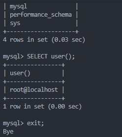
- What port is MySQL listening on?
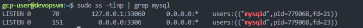

---

## TASK 2: Database and Table Management
**What you'll learn**: Create and manage databases and tables

### Steps:
1. **Create databases**:
   ```bash
   sudo mysql -u root -p
   ```
   
   Inside MySQL:
   ```sql
   -- Create application database
   CREATE DATABASE devops_app;
   
   -- Create test database
   CREATE DATABASE test_db;
   
   -- List all databases
   SHOW DATABASES;
   
   -- Select database to use
   USE devops_app;
   
   -- Show current database
   SELECT DATABASE();
   ```
   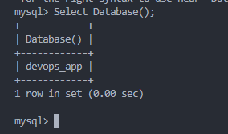

2. **Create tables with relationships**:
   ```sql
   -- Create users table
   CREATE TABLE users (
       user_id INT AUTO_INCREMENT PRIMARY KEY,
       username VARCHAR(50) UNIQUE NOT NULL,
       email VARCHAR(100) UNIQUE NOT NULL,
       password_hash VARCHAR(255) NOT NULL,
       created_at TIMESTAMP DEFAULT CURRENT_TIMESTAMP,
       last_login TIMESTAMP NULL,
       is_active BOOLEAN DEFAULT TRUE,
       INDEX idx_username (username),
       INDEX idx_email (email)
   );
   
   -- Create user profiles table
   CREATE TABLE user_profiles (
       profile_id INT AUTO_INCREMENT PRIMARY KEY,
       user_id INT UNIQUE NOT NULL,
       first_name VARCHAR(50),
       last_name VARCHAR(50),
       phone VARCHAR(20),
       address TEXT,
       FOREIGN KEY (user_id) REFERENCES users(user_id) ON DELETE CASCADE
   );
   
   -- Create application logs table
   CREATE TABLE app_logs (
       log_id INT AUTO_INCREMENT PRIMARY KEY,
       user_id INT,
       action VARCHAR(100) NOT NULL,
       details TEXT,
       ip_address VARCHAR(45),
       created_at TIMESTAMP DEFAULT CURRENT_TIMESTAMP,
       FOREIGN KEY (user_id) REFERENCES users(user_id) ON DELETE SET NULL,
       INDEX idx_user_id (user_id),
       INDEX idx_created_at (created_at)
   );
   
   -- Show all tables
   SHOW TABLES;
   
   -- Describe table structure
   DESCRIBE users;
   DESCRIBE user_profiles;
   ```

3. **Insert sample data**:
   ```sql
   -- Insert users
   INSERT INTO users (username, email, password_hash) VALUES
   ('john_doe', 'john@example.com', SHA2('password123', 256)),
   ('jane_smith', 'jane@example.com', SHA2('password456', 256)),
   ('admin_user', 'admin@example.com', SHA2('admin_pass', 256));
   
   -- Insert profiles
   INSERT INTO user_profiles (user_id, first_name, last_name, phone) VALUES
   (1, 'John', 'Doe', '+1-555-0101'),
   (2, 'Jane', 'Smith', '+1-555-0102'),
   (3, 'Admin', 'User', '+1-555-0100');
   
   -- Insert logs
   INSERT INTO app_logs (user_id, action, details, ip_address) VALUES
   (1, 'LOGIN', 'User logged in successfully', '192.168.1.100'),
   (2, 'LOGIN', 'User logged in successfully', '192.168.1.101'),
   (1, 'UPDATE_PROFILE', 'User updated profile information', '192.168.1.100');
   
   -- Verify data
   SELECT * FROM users;
   SELECT * FROM user_profiles;
   SELECT * FROM app_logs;
   ```

4. **Basic queries and joins**:
   ```sql
   -- Select with WHERE clause
   SELECT username, email FROM users WHERE is_active = TRUE;
   
   -- Join users with profiles
   SELECT u.username, p.first_name, p.last_name, p.phone
   FROM users u
   INNER JOIN user_profiles p ON u.user_id = p.user_id;
   
   -- Count logs per user
   SELECT u.username, COUNT(l.log_id) as log_count
   FROM users u
   LEFT JOIN app_logs l ON u.user_id = l.user_id
   GROUP BY u.username
   ORDER BY log_count DESC;
   
   -- Recent activity
   SELECT u.username, l.action, l.created_at
   FROM app_logs l
   INNER JOIN users u ON l.user_id = u.user_id
   ORDER BY l.created_at DESC
   LIMIT 5;
   ```

5. **Create database management script**:
   ```bash
   cat > ~/devops-learning/day9/db_manager.sh << 'EOF'
   #!/bin/bash
   # Database Management Script
   
   DB_USER="root"
   DB_PASS=""  # Will prompt for password
   
   echo "=== DATABASE MANAGEMENT TOOL ==="
   echo "1. List databases"
   echo "2. Create database"
   echo "3. Drop database"
   echo "4. List tables in database"
   echo "5. Show table structure"
   echo "6. Database size information"
   echo "7. Export database"
   echo ""
   
   read -p "Choose option (1-7): " choice
   
   case $choice in
       1)
           echo "=== DATABASES ==="
           sudo mysql -e "SHOW DATABASES;"
           ;;
       2)
           read -p "Database name to create: " db_name
           sudo mysql -e "CREATE DATABASE IF NOT EXISTS $db_name;"
           echo "Database $db_name created (if not exists)"
           ;;
       3)
           read -p "Database name to drop: " db_name
           read -p "Are you sure? (yes/no): " confirm
           if [ "$confirm" = "yes" ]; then
               sudo mysql -e "DROP DATABASE IF EXISTS $db_name;"
               echo "Database $db_name dropped"
           fi
           ;;
       4)
           read -p "Database name: " db_name
           sudo mysql -e "USE $db_name; SHOW TABLES;"
           ;;
       5)
           read -p "Database name: " db_name
           read -p "Table name: " table_name
           sudo mysql -e "USE $db_name; DESCRIBE $table_name;"
           ;;
       6)
           echo "=== DATABASE SIZES ==="
           sudo mysql -e "
           SELECT 
               table_schema AS 'Database',
               ROUND(SUM(data_length + index_length) / 1024 / 1024, 2) AS 'Size (MB)'
           FROM information_schema.tables
           GROUP BY table_schema
           ORDER BY SUM(data_length + index_length) DESC;
           "
           ;;
       7)
           read -p "Database name to export: " db_name
           backup_file="backup_${db_name}_$(date +%Y%m%d_%H%M%S).sql"
           sudo mysqldump $db_name > ~/devops-learning/day9/$backup_file
           echo "Database exported to $backup_file"
           ;;
       *)
           echo "Invalid option"
           ;;
   esac
   EOF
   
   chmod +x ~/devops-learning/day9/db_manager.sh
   ```
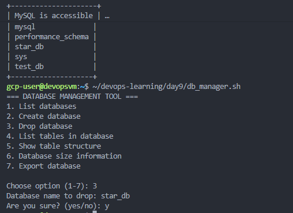
### Assessment Questions:
- How many tables did you create?
3
- Can you retrieve data using JOIN queries?
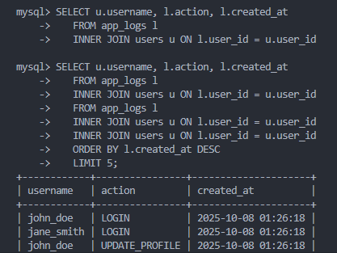
- What's the total size of your databases?
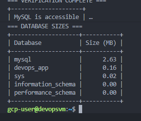

---

## TASK 3: User Management and Permissions
**What you'll learn**: Create database users and manage access control

### Steps:
1. **Create database users**:
   ```sql
   -- Create application user
   CREATE USER 'app_user'@'localhost' IDENTIFIED BY 'app_password123';
   
   -- Create read-only user
   CREATE USER 'readonly_user'@'localhost' IDENTIFIED BY 'readonly_pass';
   
   -- Create admin user
   CREATE USER 'db_admin'@'%' IDENTIFIED BY 'admin_password123';
   
   -- List all users
   SELECT user, host FROM mysql.user;
   ```

2. **Grant permissions**:
   ```sql
   -- Grant full access to app_user on devops_app database
   GRANT ALL PRIVILEGES ON devops_app.* TO 'app_user'@'localhost';
   
   -- Grant read-only access
   GRANT SELECT ON devops_app.* TO 'readonly_user'@'localhost';
   
   -- Grant admin privileges
   GRANT ALL PRIVILEGES ON *.* TO 'db_admin'@'%' WITH GRANT OPTION;
   
   -- Reload privileges
   FLUSH PRIVILEGES;
   
   -- Show grants for users
   SHOW GRANTS FOR 'app_user'@'localhost';
   SHOW GRANTS FOR 'readonly_user'@'localhost';
   ```

3. **Test user permissions**:
   ```bash
   # Test app_user
   mysql -u app_user -papp_password123 devops_app -e "SELECT * FROM users;"
   
   # Test readonly_user (should work)
   mysql -u readonly_user -preadonly_pass devops_app -e "SELECT * FROM users;"
   
   # Test readonly_user insert (should fail)
   mysql -u readonly_user -preadonly_pass devops_app -e "INSERT INTO users (username, email, password_hash) VALUES ('test', 'test@test.com', 'hash');" 2>&1 | grep "denied"
   ```

4. **Revoke and modify permissions**:
   ```sql
   -- Revoke specific permission
   REVOKE INSERT ON devops_app.* FROM 'app_user'@'localhost';
   
   -- Grant it back
   GRANT INSERT ON devops_app.* TO 'app_user'@'localhost';
   
   -- Change user password
   ALTER USER 'app_user'@'localhost' IDENTIFIED BY 'new_password456';
   
   -- Drop user
   DROP USER IF EXISTS 'temp_user'@'localhost';
   
   FLUSH PRIVILEGES;
   ```

5. **Create user management script**:
   ```bash
   cat > ~/devops-learning/day9/user_manager.sh << 'EOF'
   #!/bin/bash
   # MySQL User Management Script
   
   echo "=== MYSQL USER MANAGEMENT ==="
   echo "1. List all users"
   echo "2. Create user"
   echo "3. Grant permissions"
   echo "4. Revoke permissions"
   echo "5. Change user password"
   echo "6. Delete user"
   echo "7. Show user privileges"
   echo ""
   
   read -p "Choose option (1-7): " choice
   
   case $choice in
       1)
           echo "=== MYSQL USERS ==="
           sudo mysql -e "SELECT user, host, authentication_string FROM mysql.user;"
           ;;
       2)
           read -p "Username: " username
           read -p "Host (localhost or %): " host
           read -sp "Password: " password
           echo ""
           sudo mysql -e "CREATE USER '$username'@'$host' IDENTIFIED BY '$password';"
           echo "User $username@$host created"
           ;;
       3)
           read -p "Username: " username
           read -p "Host: " host
           read -p "Database (* for all): " database
           read -p "Permissions (ALL, SELECT, INSERT, etc.): " perms
           sudo mysql -e "GRANT $perms ON $database.* TO '$username'@'$host'; FLUSH PRIVILEGES;"
           echo "Permissions granted"
           ;;
       4)
           read -p "Username: " username
           read -p "Host: " host
           read -p "Database: " database
           read -p "Permissions to revoke: " perms
           sudo mysql -e "REVOKE $perms ON $database.* FROM '$username'@'$host'; FLUSH PRIVILEGES;"
           echo "Permissions revoked"
           ;;
       5)
           read -p "Username: " username
           read -p "Host: " host
           read -sp "New password: " password
           echo ""
           sudo mysql -e "ALTER USER '$username'@'$host' IDENTIFIED BY '$password'; FLUSH PRIVILEGES;"
           echo "Password changed"
           ;;
       6)
           read -p "Username: " username
           read -p "Host: " host
           read -p "Confirm deletion (yes/no): " confirm
           if [ "$confirm" = "yes" ]; then
               sudo mysql -e "DROP USER '$username'@'$host';"
               echo "User deleted"
           fi
           ;;
       7)
           read -p "Username: " username
           read -p "Host: " host
           sudo mysql -e "SHOW GRANTS FOR '$username'@'$host';"
           ;;
       *)
           echo "Invalid option"
           ;;
   esac
   EOF
   
   chmod +x ~/devops-learning/day9/user_manager.sh
   ```

### Assessment Questions:
- Can the readonly user perform INSERT operations?
-No, readonly_user cannot perform INSERT operations — only read data.
- What permissions does app_user have?
app_user has ALL PRIVILEGES on the devops_app database — full control limited to that database.
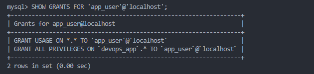
- How do you change a user's password?
ALTER USER followed by FLUSH PRIVILEGES to update a password securely.

---

## TASK 4: Backup and Recovery Strategies
**What you'll learn**: Implement comprehensive backup and restore procedures

### Steps:
1. **Create backup directory structure**:
   ```bash
   mkdir -p ~/devops-learning/day9/backups/{daily,weekly,full}
   ```

2. **Full database backup**:
   ```bash
   # Backup single database
   sudo mysqldump devops_app > ~/devops-learning/day9/backups/full/devops_app_$(date +%Y%m%d).sql
   
   # Backup all databases
   sudo mysqldump --all-databases > ~/devops-learning/day9/backups/full/all_databases_$(date +%Y%m%d).sql
   
   # Backup with compression
   sudo mysqldump devops_app | gzip > ~/devops-learning/day9/backups/full/devops_app_$(date +%Y%m%d).sql.gz
   
   # Verify backup file
   ls -lh ~/devops-learning/day9/backups/full/
   ```

3. **Incremental backup with binary logs**:
   ```bash
   # Enable binary logging (add to /etc/mysql/mysql.conf.d/mysqld.cnf)
   sudo bash -c 'cat >> /etc/mysql/mysql.conf.d/mysqld.cnf << EOF
   # Binary logging for point-in-time recovery
   log_bin = /var/log/mysql/mysql-bin.log
   expire_logs_days = 7
   max_binlog_size = 100M
   EOF'
   
   # Restart MySQL
   sudo systemctl restart mysql
   
   # Check binary logs
   sudo mysql -e "SHOW BINARY LOGS;"
   ```

4. **Restore database from backup**:
   ```bash
   # Create test scenario: drop and restore database
   sudo mysql -e "DROP DATABASE IF EXISTS test_restore;"
   
   # Create empty database
   sudo mysql -e "CREATE DATABASE test_restore;"
   
   # Restore from backup
   sudo mysql test_restore < ~/devops-learning/day9/backups/full/devops_app_*.sql
   
   # Verify restore
   sudo mysql -e "USE test_restore; SHOW TABLES;"
   ```

5. **Create comprehensive backup script**:
   ```bash
   cat > ~/devops-learning/day9/backup_system.sh << 'EOF'
   #!/bin/bash
   # Comprehensive MySQL Backup System
   
   BACKUP_DIR="$HOME/devops-learning/day9/backups"
   DATE=$(date +%Y%m%d_%H%M%S)
   RETENTION_DAYS=7
   LOG_FILE="$BACKUP_DIR/backup.log"
   
   # Logging function
   log() {
       echo "$(date '+%Y-%m-%d %H:%M:%S') - $1" | tee -a "$LOG_FILE"
   }
   
   log "=== MYSQL BACKUP STARTED ==="
   
   # Create directories
   mkdir -p "$BACKUP_DIR"/{daily,weekly,monthly}
   
   # Determine backup type
   DAY_OF_WEEK=$(date +%u)
   DAY_OF_MONTH=$(date +%d)
   
   if [ "$DAY_OF_MONTH" = "01" ]; then
       BACKUP_TYPE="monthly"
       BACKUP_PATH="$BACKUP_DIR/monthly"
   elif [ "$DAY_OF_WEEK" = "7" ]; then
       BACKUP_TYPE="weekly"
       BACKUP_PATH="$BACKUP_DIR/weekly"
   else
       BACKUP_TYPE="daily"
       BACKUP_PATH="$BACKUP_DIR/daily"
   fi
   
   log "Backup type: $BACKUP_TYPE"
   
   # Get list of databases
   DATABASES=$(sudo mysql -Nse "SHOW DATABASES;" | grep -Ev "(information_schema|performance_schema|mysql|sys)")
   
   # Backup each database
   for db in $DATABASES; do
       BACKUP_FILE="$BACKUP_PATH/${db}_${DATE}.sql.gz"
       log "Backing up database: $db"
       
       if sudo mysqldump --single-transaction --routines --triggers $db | gzip > "$BACKUP_FILE"; then
           SIZE=$(du -h "$BACKUP_FILE" | cut -f1)
           log "✅ Backup successful: $db ($SIZE)"
       else
           log "❌ Backup failed: $db"
       fi
   done
   
   # Full system backup
   FULL_BACKUP="$BACKUP_PATH/all_databases_${DATE}.sql.gz"
   log "Creating full system backup"
   
   if sudo mysqldump --all-databases --single-transaction --routines --triggers | gzip > "$FULL_BACKUP"; then
       SIZE=$(du -h "$FULL_BACKUP" | cut -f1)
       log "✅ Full backup successful ($SIZE)"
   else
       log "❌ Full backup failed"
   fi
   
   # Cleanup old backups
   log "Cleaning up old backups (keeping last $RETENTION_DAYS days)"
   find "$BACKUP_DIR/daily" -name "*.sql.gz" -mtime +$RETENTION_DAYS -delete
   find "$BACKUP_DIR/weekly" -name "*.sql.gz" -mtime +28 -delete
   find "$BACKUP_DIR/monthly" -name "*.sql.gz" -mtime +365 -delete
   
   # Backup statistics
   log "=== BACKUP STATISTICS ==="
   log "Daily backups: $(ls -1 $BACKUP_DIR/daily/*.sql.gz 2>/dev/null | wc -l)"
   log "Weekly backups: $(ls -1 $BACKUP_DIR/weekly/*.sql.gz 2>/dev/null | wc -l)"
   log "Monthly backups: $(ls -1 $BACKUP_DIR/monthly/*.sql.gz 2>/dev/null | wc -l)"
   log "Total backup size: $(du -sh $BACKUP_DIR | cut -f1)"
   
   log "=== BACKUP COMPLETED ==="
   EOF
   
   chmod +x ~/devops-learning/day9/backup_system.sh
   ~/devops-learning/day9/backup_system.sh
   ```
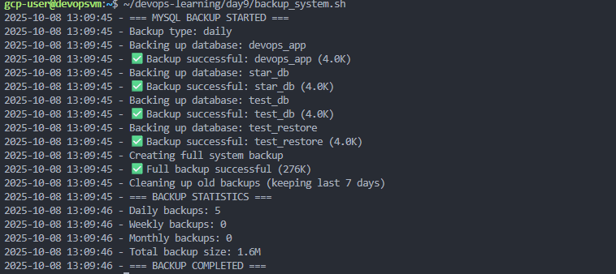
6. **Create restore script**:
   ```bash
   cat > ~/devops-learning/day9/restore_database.sh << 'EOF'
   #!/bin/bash
   # Database Restore Script
   
   BACKUP_DIR="$HOME/devops-learning/day9/backups"
   
   echo "=== MYSQL DATABASE RESTORE ==="
   echo ""
   
   # List available backups
   echo "Available backups:"
   echo "1. Daily backups"
   echo "2. Weekly backups"
   echo "3. Monthly backups"
   echo ""
   
   read -p "Choose backup type (1-3): " backup_type
   
   case $backup_type in
       1) BACKUP_PATH="$BACKUP_DIR/daily" ;;
       2) BACKUP_PATH="$BACKUP_DIR/weekly" ;;
       3) BACKUP_PATH="$BACKUP_DIR/monthly" ;;
       *) echo "Invalid option"; exit 1 ;;
   esac
   
   # List backup files
   echo ""
   echo "Available backup files:"
   ls -lh "$BACKUP_PATH"/*.sql.gz 2>/dev/null || { echo "No backups found"; exit 1; }
   echo ""
   
   read -p "Enter backup filename: " backup_file
   
   if [ ! -f "$BACKUP_PATH/$backup_file" ]; then
       echo "Backup file not found"
       exit 1
   fi
   
   # Extract database name from filename
   db_name=$(echo $backup_file | cut -d'_' -f1)
   
   echo "Database: $db_name"
   echo "Backup file: $backup_file"
   read -p "Proceed with restore? (yes/no): " confirm
   
   if [ "$confirm" != "yes" ]; then
       echo "Restore cancelled"
       exit 0
   fi
   
   # Create database if not exists
   sudo mysql -e "CREATE DATABASE IF NOT EXISTS $db_name;"
   
   # Restore database
   echo "Restoring database..."
   gunzip < "$BACKUP_PATH/$backup_file" | sudo mysql $db_name
   
   if [ $? -eq 0 ]; then
       echo "✅ Database restored successfully"
       echo "Verifying restore..."
       sudo mysql -e "USE $db_name; SHOW TABLES;"
   else
       echo "❌ Restore failed"
       exit 1
   fi
   EOF
   
   chmod +x ~/devops-learning/day9/restore_database.sh
   ```

### Assessment Questions:
- How large is your full database backup?
1.6M
- Can you successfully restore a database from backup?
- What's your backup retention strategy?

---

## TASK 5: Performance Monitoring and Optimization
**What you'll learn**: Monitor database performance and optimize queries

### Steps:
1. **Enable query logging**:
   ```bash
   # Enable slow query log
   sudo mysql -e "SET GLOBAL slow_query_log = 'ON';"
   sudo mysql -e "SET GLOBAL long_query_time = 2;"
   sudo mysql -e "SET GLOBAL slow_query_log_file = '/var/log/mysql/slow-query.log';"
   
   # Enable general query log (for debugging only)
   sudo mysql -e "SET GLOBAL general_log = 'ON';"
   sudo mysql -e "SET GLOBAL general_log_file = '/var/log/mysql/general.log';"
   ```

2. **Monitor database performance**:
   ```sql
   -- Show current connections
   SHOW PROCESSLIST;
   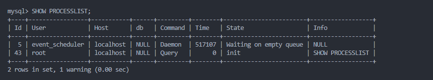
   -- Show database status
   SHOW STATUS LIKE 'Connections';
   SHOW STATUS LIKE 'Threads_connected';
   SHOW STATUS LIKE 'Queries';
   SHOW STATUS LIKE 'Slow_queries';
   
   -- Show InnoDB status
   SHOW ENGINE INNODB STATUS\G
   
   -- Show table sizes
   SELECT 
       table_schema AS 'Database',
       table_name AS 'Table',
       ROUND(((data_length + index_length) / 1024 / 1024), 2) AS 'Size (MB)'
   FROM information_schema.TABLES
   WHERE table_schema = 'devops_app'
   ORDER BY (data_length + index_length) DESC;
   ```

3. **Query optimization with EXPLAIN**:
   ```sql
   -- Analyze query execution plan
   EXPLAIN SELECT u.username, p.first_name, p.last_name
   FROM users u
   INNER JOIN user_profiles p ON u.user_id = p.user_id
   WHERE u.is_active = TRUE;
   
   -- Check index usage
   SHOW INDEX FROM users;
   SHOW INDEX FROM user_profiles;
   
   -- Create missing indexes
   CREATE INDEX idx_is_active ON users(is_active);
   
   -- Analyze table after changes
   ANALYZE TABLE users;
   ANALYZE TABLE user_profiles;
   ```

4. **Create performance monitoring script**:
   ```bash
   cat > ~/devops-learning/day9/performance_monitor.sh << 'EOF'
   #!/bin/bash
   # MySQL Performance Monitoring Script
   
   echo "=== MYSQL PERFORMANCE MONITOR ==="
   echo "Generated: $(date)"
   echo ""
   
   echo "=== CONNECTION STATISTICS ==="
   sudo mysql -e "
   SELECT 
       VARIABLE_NAME, 
       VARIABLE_VALUE 
   FROM performance_schema.global_status 
   WHERE VARIABLE_NAME IN (
       'Connections',
       'Max_used_connections',
       'Threads_connected',
       'Threads_running'
   );"
   echo ""
   
   echo "=== QUERY STATISTICS ==="
   sudo mysql -e "
   SELECT 
       VARIABLE_NAME, 
       VARIABLE_VALUE 
   FROM performance_schema.global_status 
   WHERE VARIABLE_NAME IN (
       'Questions',
       'Queries',
       'Slow_queries',
       'Com_select',
       'Com_insert',
       'Com_update',
       'Com_delete'
   );"
   echo ""
   
   echo "=== INNODB BUFFER POOL ==="
   sudo mysql -e "
   SELECT 
       VARIABLE_NAME, 
       VARIABLE_VALUE 
   FROM performance_schema.global_status 
   WHERE VARIABLE_NAME LIKE 'Innodb_buffer_pool%'
   LIMIT 10;"
   echo ""
   
   echo "=== CURRENT PROCESSES ==="
   sudo mysql -e "SHOW PROCESSLIST;" | head -20
   echo ""
   
   echo "=== DATABASE SIZES ==="
   sudo mysql -e "
   SELECT 
       table_schema AS 'Database',
       ROUND(SUM(data_length + index_length) / 1024 / 1024, 2) AS 'Size (MB)',
       ROUND(SUM(data_length) / 1024 / 1024, 2) AS 'Data (MB)',
       ROUND(SUM(index_length) / 1024 / 1024, 2) AS 'Index (MB)'
   FROM information_schema.tables
   GROUP BY table_schema
   ORDER BY SUM(data_length + index_length) DESC;"
   echo ""
   
   echo "=== SLOW QUERIES ==="
   slow_count=$(sudo mysql -Nse "SHOW STATUS LIKE 'Slow_queries';" | awk '{print $2}')
   echo "Total slow queries: $slow_count"
   if [ -f /var/log/mysql/slow-query.log ]; then
       echo "Recent slow queries:"
       sudo tail -20 /var/log/mysql/slow-query.log
   fi
   echo ""
   
   echo "=== PERFORMANCE RECOMMENDATIONS ==="
   threads_connected=$(sudo mysql -Nse "SHOW STATUS LIKE 'Threads_connected';" | awk '{print $2}')
   max_connections=$(sudo mysql -Nse "SHOW VARIABLES LIKE 'max_connections';" | awk '{print $2}')
   
   usage_percent=$((threads_connected * 100 / max_connections))
   
   if [ $usage_percent -gt 80 ]; then
       echo "⚠️  Connection pool usage high: ${usage_percent}%"
       echo "   Consider increasing max_connections"
   else
       echo "✅ Connection pool usage healthy: ${usage_percent}%"
   fi
   
   echo ""
   echo "=== MONITORING COMPLETE ==="
   EOF
   
   chmod +x ~/devops-learning/day9/performance_monitor.sh
   ~/devops-learning/day9/performance_monitor.sh
   ```

5. **Optimize database configuration**:
   ```bash
   # Create optimized configuration
   cat > ~/devops-learning/day9/mysql-optimized.cnf << 'EOF'
   # MySQL Optimization Configuration
   
   [mysqld]
   # Connection settings
   max_connections = 200
   max_connect_errors = 100
   
   # InnoDB Buffer Pool (set to 70-80% of available RAM)
   innodb_buffer_pool_size = 1G
   innodb_buffer_pool_instances = 4
   
   # Query cache (disabled in MySQL 8.0+)
   # query_cache_type = 1
   # query_cache_size = 64M
   
   # Logging
   slow_query_log = 1
   slow_query_log_file = /var/log/mysql/slow-query.log
   long_query_time = 2
   log_queries_not_using_indexes = 1
   
   # InnoDB settings
   innodb_flush_log_at_trx_commit = 2
   innodb_log_file_size = 256M
   innodb_flush_method = O_DIRECT
   
   # Table cache
   table_open_cache = 4000
   table_definition_cache = 2000
   
   # Thread cache
   thread_cache_size = 100
   
   # Temporary tables
   tmp_table_size = 64M
   max_heap_table_size = 64M
   EOF
   
   echo "Review and apply optimizations to /etc/mysql/mysql.conf.d/mysqld.cnf"
   ```

### Assessment Questions:
- How many slow queries are in your database?
- What's your current connection pool usage percentage?
- Which tables consume the most disk space?

---

## TASK 6: Database Replication Setup
**What you'll learn**: Configure MySQL master-slave replication

### Steps:
1. **Configure master server** (if you have two servers):
   ```bash
   # Edit MySQL config on master
   sudo nano /etc/mysql/mysql.conf.d/mysqld.cnf
   
   # Add these lines:
   # server-id = 1
   # log_bin = /var/log/mysql/mysql-bin.log
   # binlog_do_db = devops_app
   
   # Restart MySQL
   sudo systemctl restart mysql
   ```

2. **Create replication user on master**:
   ```sql
   -- On master server
   CREATE USER 'replication_user'@'%' IDENTIFIED BY 'replication_password';
   GRANT REPLICATION SLAVE ON *.* TO 'replication_user'@'%';
   FLUSH PRIVILEGES;
   
   -- Check master status
   SHOW MASTER STATUS;
   -- Note the File and Position values
   ```

3. **Configure slave server**:
   ```bash
   # Edit MySQL config on slave
   sudo nano /etc/mysql/mysql.conf.d/mysqld.cnf
   
   # Add these lines:
   # server-id = 2
   # relay-log = /var/log/mysql/mysql-relay-bin.log
   # log_bin = /var/log/mysql/mysql-bin.log
   # binlog_do_db = devops_app
   # read_only = 1
   
   # Restart MySQL
   sudo systemctl restart mysql
   ```

4. **Set up replication on slave**:
   ```sql
   -- On slave server
   CHANGE MASTER TO
     MASTER_HOST='master_ip_address',
     MASTER_USER='replication_user',
     MASTER_PASSWORD='replication_password',
     MASTER_LOG_FILE='mysql-bin.000001',  -- From SHOW MASTER STATUS
     MASTER_LOG_POS=154;  -- From SHOW MASTER STATUS
   
   -- Start replication
   START SLAVE;
   
   -- Check slave status
   SHOW SLAVE STATUS\G
   ```

5. **Create replication monitoring script**:
   ```bash
   cat > ~/devops-learning/day9/replication_check.sh << 'EOF'
   #!/bin/bash
   # MySQL Replication Monitoring Script
   
   echo "=== MYSQL REPLICATION STATUS ==="
   echo "Generated: $(date)"
   echo ""
   
   echo "=== MASTER STATUS ==="
   sudo mysql -e "SHOW MASTER STATUS\G"
   echo ""
   
   echo "=== SLAVE STATUS ==="
   sudo mysql -e "SHOW SLAVE STATUS\G" | grep -E "Slave_IO_Running|Slave_SQL_Running|Seconds_Behind_Master|Last_Error"
   echo ""
   
   # Check replication health
   io_running=$(sudo mysql -Nse "SHOW SLAVE STATUS\G" | grep "Slave_IO_Running:" | awk '{print $2}')
   sql_running=$(sudo mysql -Nse "SHOW SLAVE STATUS\G" | grep "Slave_SQL_Running:" | awk '{print $2}')
   
   if [ "$io_running" = "Yes" ] && [ "$sql_running" = "Yes" ]; then
       echo "✅ Replication is healthy"
   else
       echo "❌ Replication has issues"
       echo "   IO Running: $io_running"
       echo "   SQL Running: $sql_running"
   fi
   
   echo ""
   echo "=== BINARY LOGS ==="
   sudo mysql -e "SHOW BINARY LOGS;"
   
   echo ""
   echo "=== MONITORING COMPLETE ==="
   EOF
   
   chmod +x ~/devops-learning/day9/replication_check.sh
   ```

### Assessment Questions:
- Is replication working correctly between master and slave?
- What's the replication lag in seconds?
- Can you identify replication errors if they occur?

---

## TASK 7: Database Automation and Maintenance
**What you'll learn**: Automate routine database maintenance tasks

### Steps:
1. **Create table optimization script**:
   ```bash
   cat > ~/devops-learning/day9/optimize_tables.sh << 'EOF'
   #!/bin/bash
   # Table Optimization Script
   
   echo "=== DATABASE OPTIMIZATION ==="
   echo "Started: $(date)"
   echo ""
   
   # Get all databases except system databases
   DATABASES=$(sudo mysql -Nse "SHOW DATABASES;" | grep -Ev "(information_schema|performance_schema|mysql|sys)")
   
   for db in $DATABASES; do
       echo "Optimizing database: $db"
       TABLES=$(sudo mysql -Nse "USE $db; SHOW TABLES;")
       
       for table in $TABLES; do
           echo "  Optimizing table: $table"
           sudo mysql -e "USE $db; OPTIMIZE TABLE $table;" > /dev/null 2>&1
           sudo mysql -e "USE $db; ANALYZE TABLE $table;" > /dev/null 2>&1
       done
       echo "  Database $db optimization complete"
   done
   
   echo ""
   echo "=== OPTIMIZATION COMPLETE ==="
   echo "Finished: $(date)"
   EOF
   
   chmod +x ~/devops-learning/day9/optimize_tables.sh
   ```

2. **Create automated cleanup script**:
   ```bash
   cat > ~/devops-learning/day9/cleanup_database.sh << 'EOF'
   #!/bin/bash
   # Database Cleanup Script
   
   echo "=== DATABASE CLEANUP ==="
   echo "Started: $(date)"
   echo ""
   
   # Clean old log entries (older than 30 days)
   echo "Cleaning old log entries..."
   sudo mysql -e "
   USE devops_app;
   DELETE FROM app_logs 
   WHERE created_at < DATE_SUB(NOW(), INTERVAL 30 DAY);
   SELECT ROW_COUNT() AS 'Rows deleted';
   "
   
   # Clean old sessions (if you have session table)
   # sudo mysql -e "DELETE FROM sessions WHERE updated_at < DATE_SUB(NOW(), INTERVAL 7 DAY);"
   
   # Optimize tables after deletion
   echo "Optimizing tables..."
   sudo mysql -e "USE devops_app; OPTIMIZE TABLE app_logs;"
   
   # Purge old binary logs
   echo "Purging old binary logs..."
   sudo mysql -e "PURGE BINARY LOGS BEFORE DATE_SUB(NOW(), INTERVAL 7 DAY);"
   
   echo ""
   echo "=== CLEANUP COMPLETE ==="
   echo "Finished: $(date)"
   EOF
   
   chmod +x ~/devops-learning/day9/cleanup_database.sh
   ```

3. **Set up automated cron jobs**:
   ```bash
   # Add cron jobs for automated maintenance
   (crontab -l 2>/dev/null; cat << 'EOF'
   # MySQL Automated Maintenance
   
   # Daily backup at 2 AM
   0 2 * * * /home/$USER/devops-learning/day9/backup_system.sh >> /home/$USER/devops-learning/day9/cron.log 2>&1
   
   # Weekly optimization on Sunday at 3 AM
   0 3 * * 0 /home/$USER/devops-learning/day9/optimize_tables.sh >> /home/$USER/devops-learning/day9/cron.log 2>&1
   
   # Daily cleanup at 4 AM
   0 4 * * * /home/$USER/devops-learning/day9/cleanup_database.sh >> /home/$USER/devops-learning/day9/cron.log 2>&1
   
   # Performance monitoring every 6 hours
   0 */6 * * * /home/$USER/devops-learning/day9/performance_monitor.sh >> /home/$USER/devops-learning/day9/monitoring.log 2>&1
   EOF
   ) | crontab -
   
   # Verify cron jobs
   crontab -l
   ```

4. **Create comprehensive maintenance script**:
   ```bash
   cat > ~/devops-learning/day9/full_maintenance.sh << 'EOF'
   #!/bin/bash
   # Comprehensive Database Maintenance Script
   
   LOG_FILE="$HOME/devops-learning/day9/maintenance_$(date +%Y%m%d_%H%M%S).log"
   
   log() {
       echo "$(date '+%Y-%m-%d %H:%M:%S') - $1" | tee -a "$LOG_FILE"
   }
   
   log "=== DATABASE MAINTENANCE STARTED ==="
   
   # 1. Backup databases
   log "Step 1: Creating backups..."
   bash ~/devops-learning/day9/backup_system.sh >> "$LOG_FILE" 2>&1
   
   # 2. Check database integrity
   log "Step 2: Checking database integrity..."
   DATABASES=$(sudo mysql -Nse "SHOW DATABASES;" | grep -Ev "(information_schema|performance_schema|mysql|sys)")
   for db in $DATABASES; do
       log "  Checking: $db"
       sudo mysql -e "USE $db; CHECK TABLE $(sudo mysql -Nse "USE $db; SHOW TABLES;" | tr '\n' ',' | sed 's/,$//');" >> "$LOG_FILE" 2>&1
   done
   
   # 3. Optimize tables
   log "Step 3: Optimizing tables..."
   bash ~/devops-learning/day9/optimize_tables.sh >> "$LOG_FILE" 2>&1
   
   # 4. Cleanup old data
   log "Step 4: Cleaning up old data..."
   bash ~/devops-learning/day9/cleanup_database.sh >> "$LOG_FILE" 2>&1
   
   # 5. Performance analysis
   log "Step 5: Analyzing performance..."
   bash ~/devops-learning/day9/performance_monitor.sh >> "$LOG_FILE" 2>&1
   
   # 6. Generate maintenance report
   log "Step 6: Generating maintenance report..."
   cat > "$HOME/devops-learning/day9/maintenance_report_$(date +%Y%m%d).txt" << REPORT
   MySQL Maintenance Report
   Generated: $(date)
   
   DATABASE SIZES:
   $(sudo mysql -e "
   SELECT 
       table_schema AS 'Database',
       ROUND(SUM(data_length + index_length) / 1024 / 1024, 2) AS 'Size (MB)'
   FROM information_schema.tables
   GROUP BY table_schema
   ORDER BY SUM(data_length + index_length) DESC;")
   
   BACKUP STATUS:
   Daily backups: $(ls -1 ~/devops-learning/day9/backups/daily/*.sql.gz 2>/dev/null | wc -l)
   Weekly backups: $(ls -1 ~/devops-learning/day9/backups/weekly/*.sql.gz 2>/dev/null | wc -l)
   Total backup size: $(du -sh ~/devops-learning/day9/backups | cut -f1)
   
   PERFORMANCE METRICS:
   Total connections: $(sudo mysql -Nse "SHOW STATUS LIKE 'Connections';" | awk '{print $2}')
   Slow queries: $(sudo mysql -Nse "SHOW STATUS LIKE 'Slow_queries';" | awk '{print $2}')
   Uptime: $(sudo mysql -Nse "SHOW STATUS LIKE 'Uptime';" | awk '{print $2/3600}') hours
   
   MAINTENANCE ACTIONS:
   - Backups created successfully
   - Database integrity verified
   - Tables optimized
   - Old data cleaned up
   - Performance analyzed
   
   Next maintenance scheduled: $(date -d '+1 week')
REPORT
   
   log "=== MAINTENANCE COMPLETED ==="
   log "Full report: $HOME/devops-learning/day9/maintenance_report_$(date +%Y%m%d).txt"
   EOF
   
   chmod +x ~/devops-learning/day9/full_maintenance.sh
   ```

### Assessment Questions:
- Are your automated backups running on schedule?
- How much disk space do your backups consume?
- What optimization tasks are automated?

---

## TASK 8: Security Hardening and Monitoring
**What you'll learn**: Implement database security best practices

### Steps:
1. **Security audit script**:
   ```bash
   cat > ~/devops-learning/day9/security_audit.sh << 'EOF'
   #!/bin/bash
   # MySQL Security Audit Script
   
   echo "=== MYSQL SECURITY AUDIT ==="
   echo "Generated: $(date)"
   echo ""
   
   echo "=== USER SECURITY CHECK ==="
   echo "Users without passwords:"
   sudo mysql -e "SELECT user, host FROM mysql.user WHERE authentication_string = '' OR authentication_string IS NULL;"
   echo ""
   
   echo "Users with weak passwords (empty or test):"
   sudo mysql -e "SELECT user, host FROM mysql.user WHERE user IN ('test', 'demo', '');"
   echo ""
   
   echo "Root access from anywhere:"
   sudo mysql -e "SELECT user, host FROM mysql.user WHERE user = 'root' AND host = '%';"
   echo ""
   
   echo "=== PRIVILEGE ANALYSIS ==="
   echo "Users with ALL privileges:"
   sudo mysql -e "
   SELECT DISTINCT grantee 
   FROM information_schema.user_privileges 
   WHERE privilege_type = 'ALL PRIVILEGES';
   "
   echo ""
   
   echo "=== ANONYMOUS USERS ==="
   sudo mysql -e "SELECT user, host FROM mysql.user WHERE user = '';"
   echo ""
   
   echo "=== SSL/TLS STATUS ==="
   sudo mysql -e "SHOW VARIABLES LIKE 'have_ssl';"
   echo ""
   
   echo "=== BINARY LOGGING ==="
   sudo mysql -e "SHOW VARIABLES LIKE 'log_bin';"
   echo ""
   
   echo "=== FILE PERMISSIONS CHECK ==="
   echo "MySQL data directory:"
   ls -ld /var/lib/mysql/
   echo ""
   echo "MySQL config files:"
   ls -l /etc/mysql/mysql.conf.d/mysqld.cnf
   echo ""
   
   echo "=== SECURITY RECOMMENDATIONS ==="
   echo "1. Ensure all users have strong passwords"
   echo "2. Remove anonymous users"
   echo "3. Disable root remote login"
   echo "4. Enable SSL/TLS for connections"
   echo "5. Regular security updates"
   echo "6. Implement least privilege principle"
   echo "7. Monitor failed login attempts"
   echo ""
   
   echo "=== AUDIT COMPLETE ==="
   EOF
   
   chmod +x ~/devops-learning/day9/security_audit.sh
   ~/devops-learning/day9/security_audit.sh
   ```

2. **Implement connection monitoring**:
   ```bash
   cat > ~/devops-learning/day9/connection_monitor.sh << 'EOF'
   #!/bin/bash
   # Connection Monitoring Script
   
   echo "=== CONNECTION MONITORING ==="
   echo "Time: $(date)"
   echo ""
   
   echo "=== ACTIVE CONNECTIONS ==="
   sudo mysql -e "
   SELECT 
       id,
       user,
       host,
       db,
       command,
       time,
       state,
       LEFT(info, 50) as query
   FROM information_schema.processlist
   WHERE command != 'Sleep'
   ORDER BY time DESC;
   "
   echo ""
   
   echo "=== CONNECTION STATISTICS ==="
   sudo mysql -e "
   SELECT 
       user,
       COUNT(*) as connection_count
   FROM information_schema.processlist
   GROUP BY user
   ORDER BY connection_count DESC;
   "
   echo ""
   
   echo "=== FAILED CONNECTIONS ==="
   sudo grep "Access denied" /var/log/mysql/error.log 2>/dev/null | tail -5 || echo "No recent failed connections"
   echo ""
   
   echo "=== CONNECTION LIMITS ==="
   max_conn=$(sudo mysql -Nse "SHOW VARIABLES LIKE 'max_connections';" | awk '{print $2}')
   current_conn=$(sudo mysql -Nse "SHOW STATUS LIKE 'Threads_connected';" | awk '{print $2}')
   echo "Max connections: $max_conn"
   echo "Current connections: $current_conn"
   echo "Usage: $((current_conn * 100 / max_conn))%"
   
   echo ""
   echo "=== MONITORING COMPLETE ==="
   EOF
   
   chmod +x ~/devops-learning/day9/connection_monitor.sh
   ```

3. **Create alert system for suspicious activity**:
   ```bash
   cat > ~/devops-learning/day9/security_alerts.sh << 'EOF'
   #!/bin/bash
   # Security Alert System
   
   ALERT_LOG="$HOME/devops-learning/day9/security_alerts.log"
   
   log_alert() {
       echo "$(date '+%Y-%m-%d %H:%M:%S') - ALERT: $1" | tee -a "$ALERT_LOG"
   }
   
   echo "=== SECURITY ALERT CHECK ==="
   
   # Check for excessive failed logins
   failed_logins=$(sudo grep -c "Access denied" /var/log/mysql/error.log 2>/dev/null || echo "0")
   if [ "$failed_logins" -gt 10 ]; then
       log_alert "High number of failed login attempts: $failed_logins"
   fi
   
   # Check for root remote access
   root_remote=$(sudo mysql -Nse "SELECT COUNT(*) FROM mysql.user WHERE user='root' AND host='%';")
   if [ "$root_remote" -gt 0 ]; then
       log_alert "Root user accessible remotely - security risk!"
   fi
   
   # Check for users without passwords
   no_password=$(sudo mysql -Nse "SELECT COUNT(*) FROM mysql.user WHERE authentication_string = '';")
   if [ "$no_password" -gt 0 ]; then
       log_alert "Users without passwords detected: $no_password"
   fi
   
   # Check connection spike
   current_conn=$(sudo mysql -Nse "SHOW STATUS LIKE 'Threads_connected';" | awk '{print $2}')
   max_conn=$(sudo mysql -Nse "SHOW VARIABLES LIKE 'max_connections';" | awk '{print $2}')
   usage=$((current_conn * 100 / max_conn))
   
   if [ "$usage" -gt 90 ]; then
       log_alert "Connection pool near capacity: ${usage}%"
   fi
   
   # Check for long-running queries
   long_queries=$(sudo mysql -Nse "SELECT COUNT(*) FROM information_schema.processlist WHERE time > 300 AND command != 'Sleep';")
   if [ "$long_queries" -gt 0 ]; then
       log_alert "Long-running queries detected: $long_queries queries over 5 minutes"
   fi
   
   echo "Security check completed. Alerts logged to: $ALERT_LOG"
   EOF
   
   chmod +x ~/devops-learning/day9/security_alerts.sh
   ```

### Assessment Questions:
- Are there any security vulnerabilities in your MySQL setup?
- How many failed login attempts have occurred?
- Are all users following the principle of least privilege?

---

## Day 9 Final Challenge: Complete Database Infrastructure

### Implement Production-Ready Database System:

```bash
cat > ~/devops-learning/day9/production_setup.sh << 'EOF'
#!/bin/bash
# Production Database Setup Script

echo "=== PRODUCTION DATABASE SETUP ==="

# 1. Create production database
sudo mysql << SQL
CREATE DATABASE IF NOT EXISTS production_app;

-- Create application user
CREATE USER IF NOT EXISTS 'prod_app'@'localhost' IDENTIFIED BY 'secure_prod_password';
GRANT SELECT, INSERT, UPDATE, DELETE ON production_app.* TO 'prod_app'@'localhost';

-- Create read-only reporting user
CREATE USER IF NOT EXISTS 'reporting'@'localhost' IDENTIFIED BY 'reporting_password';
GRANT SELECT ON production_app.* TO 'reporting'@'localhost';

-- Create admin user
CREATE USER IF NOT EXISTS 'db_admin'@'localhost' IDENTIFIED BY 'admin_secure_password';
GRANT ALL PRIVILEGES ON production_app.* TO 'db_admin'@'localhost';

FLUSH PRIVILEGES;

-- Create production tables
USE production_app;

CREATE TABLE IF NOT EXISTS customers (
    customer_id INT AUTO_INCREMENT PRIMARY KEY,
    email VARCHAR(255) UNIQUE NOT NULL,
    name VARCHAR(100) NOT NULL,
    created_at TIMESTAMP DEFAULT CURRENT_TIMESTAMP,
    INDEX idx_email (email)
) ENGINE=InnoDB;

CREATE TABLE IF NOT EXISTS orders (
    order_id INT AUTO_INCREMENT PRIMARY KEY,
    customer_id INT NOT NULL,
    order_date TIMESTAMP DEFAULT CURRENT_TIMESTAMP,
    total_amount DECIMAL(10,2) NOT NULL,
    status ENUM('pending', 'processing', 'completed', 'cancelled') DEFAULT 'pending',
    FOREIGN KEY (customer_id) REFERENCES customers(customer_id),
    INDEX idx_customer (customer_id),
    INDEX idx_status (status),
    INDEX idx_date (order_date)
) ENGINE=InnoDB;

CREATE TABLE IF NOT EXISTS audit_log (
    log_id INT AUTO_INCREMENT PRIMARY KEY,
    table_name VARCHAR(50) NOT NULL,
    action VARCHAR(20) NOT NULL,
    record_id INT,
    user VARCHAR(50),
    timestamp TIMESTAMP DEFAULT CURRENT_TIMESTAMP,
    INDEX idx_table (table_name),
    INDEX idx_timestamp (timestamp)
) ENGINE=InnoDB;

SQL

echo "✅ Production database created"
echo "✅ Users configured with proper permissions"
echo "✅ Tables created with indexes"
echo ""
echo "Next steps:"
echo "1. Set up automated backups"
echo "2. Configure monitoring"
echo "3. Implement replication"
echo "4. Set up alerting"
EOF

chmod +x ~/devops-learning/day9/production_setup.sh
```

### Final Assessment:
- Deploy the complete production database setup
- Verify all security measures are in place
- Test backup and recovery procedures
- Confirm monitoring and alerting work correctly
- Document the entire infrastructure

---

## Day 9 Summary

### Skills Mastered:
- MySQL installation and configuration
- Database and table management with proper indexing
- User permissions and access control
- Comprehensive backup and recovery strategies
- Performance monitoring and optimization
- Database replication setup
- Automation of routine maintenance
- Security hardening and auditing

### Production Readiness Checklist:
- [ ] MySQL installed and secured
- [ ] Databases created with proper structure
- [ ] Users configured with least privilege
- [ ] Automated backup system running
- [ ] Performance monitoring active
- [ ] Replication configured (if multi-server)
- [ ] Maintenance tasks automated
- [ ] Security audit passed
- [ ] Monitoring and alerting implemented
- [ ] Documentation complete

### Real-World Applications:
- **E-commerce platforms**: Product catalogs and order management
- **User authentication**: Secure credential storage
- **Application logging**: Audit trails and debugging
- **Analytics**: Business intelligence and reporting
- **Content management**: CMS and blog platforms

### Best Practices Learned:
1. Always secure MySQL installation after setup
2. Implement automated backups with retention policies
3. Monitor performance metrics regularly
4. Use proper indexing for query optimization
5. Follow least privilege principle for users
6. Regular maintenance and optimization
7. Keep security patches up to date
8. Document all configurations

### Next Steps (Day 10 Preview):
- Advanced backup strategies
- Disaster recovery planning
- High availability configurations
- Database clustering
- Multi-master replication

Congratulations! You've mastered database administration fundamentals and are ready to manage production database systems with confidence.